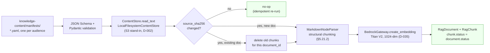
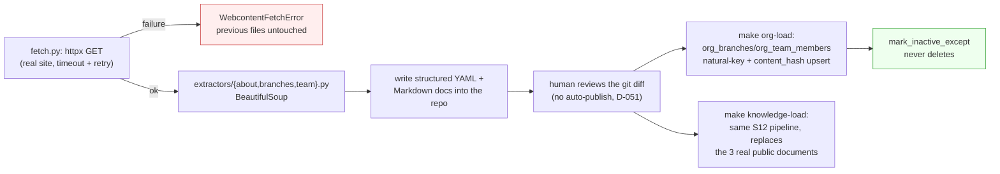
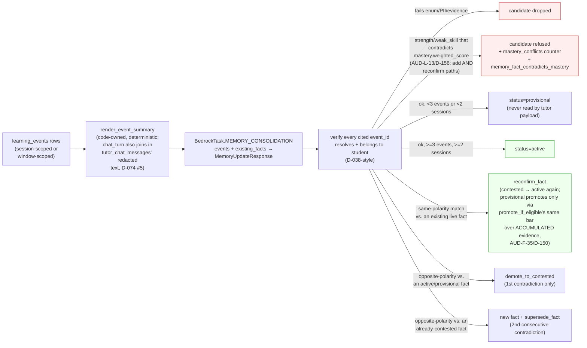
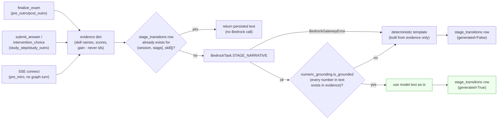
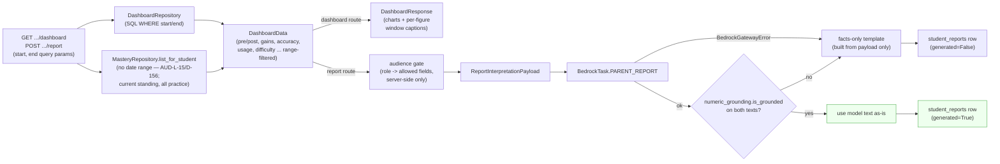

# Architecture

The system as built through **S0–S34 plus the S36–S43 audit and stabilization work and the
§2.6 launch gate** — the deterministic learning core, the S8 Bedrock gateway, the S9 AI
question-generation pipeline, the S10 adaptive mastery/retry ladder, the S11 real-time
learning frontend, S12–S13's RAG ingestion + hybrid search + Q&A graph, S14–S15's MCP tool
registry (Gmail, Calendar, Maps, YouTube), S16's chat frontend, S17–S19's real org content
and access-aware refusals, S20–S23's question bank / hint ladder / exam policy + frontend,
S24–S28's tutoring chat, memory, personalized transitions and reports, S30–S31's evaluation
platform and observability, and S32–S35's live staging deployment and pipeline. This file is
a map of *what exists now*, not the full target design — [SPEC.md](SPEC.md) is the spec,
[ROADMAP.md](ROADMAP.md) tracks what's next, and [DECISIONS.md](DECISIONS.md) records why
each non-obvious choice was made. Session provenance is tagged in each node (e.g. `(S6)`).

**Not built, with reasons rather than "later":**

- **Multimodal solution images (S29)** — deferred, not merely unbuilt: **D-078**. The one
  genuinely absent feature of the original scope.
- **The production environment (S48) and the real integration with `go.intellichoice.org`
  (S42–S47)** — staging is live and real; production and the `IcProfileAdapter` are not.
- **Independent auth, consent capture, and §5.1.2's first-visit notice (S44/S45)** — the
  apps still issue dev tokens; the notice is dispositioned to S45, not written (**T-02**,
  D-129).
- **Real Google/YouTube credentials** — `youtube-sync` now *has* a real weekly EventBridge
  schedule but ships **deliberately disabled**, because `youtube_provider` defaults to
  `fake` and an unattended run would write fabricated catalog rows on a schedule, which is
  worse than not running (D-105). `make webcontent-sync` remains manual for the same class
  of reason. The three enabled schedules — `chat-purge`, `retention-purge`,
  `memory-consolidate` — do run unattended.

**Two shipped behaviors that deviate from the plan's own recommendation**, recorded here
because reading the spec alone would mispredict the code: S22 kept **grade-on-submit** rather
than save-then-finalize, and gave pre/post exams a real default timer (a user decision against
the plan, **D-064**); and the org's local-time convention is a **provisional default with an
env switch** (`ORG_TIMEZONE`/`ORG_TIME_CONVENTION`, **D-130**) rather than a decided value,
because it belongs to the organization and has not been confirmed. **Since D-153 §4 the choice is
also known not to matter operationally:** the two candidate conventions diverge only for sessions
starting 00:00–01:00 local (which date) or on a Sunday evening (which week), and the org's
published schedule is Mon–Fri 10:00–12:00 and 18:00–20:00 — neither window. The switch stays, and
S43 asserts the property against real session data rather than trusting the published schedule.

*(This paragraph was rewritten 2026-07-30. The version before it still listed memory, eval,
observability and deployment as unbuilt — all four had shipped in S25/S30/S31/S32, and the
staleness mattered: the §2.6 criterion-9 PII evidence rests on exactly the tracing and logging
this file said did not exist. A "not yet built" list is the fastest part of an architecture doc
to rot, because nothing fails when it does.)*

## Cross-cutting invariants the diagrams encode

- **Authored content is served from the bank, not regenerated** (D-207). An authored template's
  `canonical_solution` was verified by the offline pipeline (SymPy re-solve + answer-key agreement)
  and written to `question_templates.canonical_solution` by the loader; the serving path reads it
  back rather than paying an LLM to re-derive it. `tutor.stored_solution` is the seam - it returns
  `None` for a shape template (which has none) and for a stored blob that fails its own re-check,
  and both fall through to generation. The general rule this instance of: **anything the offline
  pipeline already proved is cheaper and more reliable to read than to re-ask.**
- **A truncated structured response is the caller's decision, not the gateway's** (D-207). The
  gateway refuses to retry under the same ceiling (D-115, and it is right to - same prompt, same
  ceiling, same truncation). `OutputTruncatedError` exists so a caller who can raise the ceiling can
  tell that case apart from malformed JSON, where a retry really is waste. Only `tutor_chat` uses
  it, once, at 800 tokens.
- **The authoring pipeline is five model calls with different jobs, not one** (D-200/D-205). In
  order: an equation *design* call whose six-field output is solved by SymPy before anything is
  written around it; an *authoring* call that builds the item on that verified skeleton; two
  independent *solvers* that read the question as a student would; and a *judge* that rates
  difficulty against an anchored rubric shared with the design stage. The roles are separately
  configurable because they want opposite things from a model - design needs tool use, authoring
  needs reliable emission of a fifteen-field forced schema, and on this account no single model is
  good at both. `BedrockTask.EQUATION_DESIGN` is what lets them differ.
- **The gateway can hand the model tools, and does so exactly once** (D-202/D-204). The provider
  runs a bounded Converse loop when tools are passed, executing them in-process; SymPy is exposed
  as `solve_equation` so the design stage can check its own arithmetic while it still has the option
  to change the numbers. Measured: a fifteen-field forced schema and a tool loop do not compose -
  tools go where the output is small.
- **Prompt caching is declared at the two prefixes that repeat** (D-203) - after the system prompt,
  identical for every candidate in a run, and after the first user message, identical for every
  round of one candidate's tool loop. Gated to model families measured to accept it.


- **PII boundary** — MySQL is the only store holding names/emails/roles/attendance;
  PostgreSQL holds `*_external_id` references only (CLAUDE.md non-negotiable #1). LLM
  payloads cross the gateway with a restricted field set (D-023/D-026). One narrow,
  documented exception: `org_branches`/`org_team_members` hold the org's own already-
  public staff bios and branch contact info (S17, D-050) - not student/parent/guardian
  PII, and explicitly allowlisted by name/column in `test_schema_purity.py` rather than
  a blanket carve-out.
  **The floor is enforced per store and verified per store, because it does not transfer**
  (D-104 §4: the S38 log scan was clean while a bearer JWT sat in every SSE span). Unit level:
  `test_schema_purity.py` (Postgres), `test_bedrock_payload_pii_floor.py` (LLM payloads),
  `test_tracing.py` (the `RedactingSpanExporter`). Live level: `make scan-traces` and
  `make scan-logs` share one positive-controlled matcher whose needles come from the fixture
  seed module, and both **fail rather than report clean** when they cannot see their window
  (D-129). Instrumentation added later re-opens the question rather than inheriting the answer.
  **Health endpoints emit no telemetry at all** (AUD-F-30, D-132), suppressed at the `/readyz`
  handler rather than per query, so the trace corpus a scan walks is now real traffic instead of
  ~97% ALB health checks — the denominator means what a reader assumes. That fix took three
  attempts and the first made volume 3.4× *worse*, because excluding a server span **orphans its
  child spans into separate root traces** rather than removing them; only re-measuring caught it.
- **Capacity scales with *simultaneous* users, not total users, and the relationship is
  measured** (D-134). Each task runs **one uvicorn worker**, so a task's throughput is bounded by
  CPU per request and cannot be bought with a bigger task past 1024 CPU units — the lever is task
  count. Measured on staging at a pinned 2 tasks: **throughput saturates at roughly 5 concurrent
  requests per task**, and beyond that added concurrency buys latency and nothing else, growing
  about **`concurrency^1.55`** (ALB p95 0.33 s at 2.5 concurrent/task against 2.98 s at 12.5).
  **So most of a loaded request is queueing, not work:** at 25 concurrent, ~89% of an answer
  request is neither SQL nor time inside the graph node, while an unloaded request spends 13.5 ms
  there in total. Two consequences worth knowing before optimising anything here: removing
  round-trips does **not** buy latency when CPU is the scarce resource (D-132 measured exactly
  that), and capacity should be planned from a target **concurrency-per-task ratio** rather than a
  task count.
- **The ratio is now priced, and the answer is that the pilot's real target is cheap while
  §6.23's 150 is not** (D-136). Interpolating ALB p95 between the only two measured arms —
  `p95 ≈ 0.31 s × (r/2.5)^1.4`, where `r` is concurrent users per task, exponent 1.37–1.45
  depending on which of A/A′ anchors the low end:

  | target `r` | p95 | tasks at 25 concurrent | tasks at 150 |
  |---|---|---|---|
  | 12.5 (**today**) | 2.95 s | **2** | 12 |
  | 10 | 2.16 s | 3 | 15 |
  | 7.5 | 1.44 s | 4 | 20 |
  | 5 | **0.82 s** | **5** | 30 |
  | 2.5 | 0.31 s | 10 | 60 |

  **Do not extrapolate outside `r` ∈ [2.5, 12.5]** — two points cannot establish a functional
  form, which is the exact error D-134's own pre-registered prediction made in the other
  direction. The headline: **at the documented pilot target of 25 concurrent, a comfortable p95
  costs three more tasks, not twenty-eight.** 2 → 5 tasks moves p95 from a 0.7%-margin 2.98 s to
  ~0.8 s.
- **Connection ceilings scale with total concurrency, not with task count — provided the pool is
  resized with it.** `create_engine`'s `pool_size=10, max_overflow=10` was sized in S34 for **one**
  process serving 150 concurrent sessions; it is a per-task constant, so multiplying tasks
  multiplies *idle pool capacity* rather than useful connections. A session holds one connection
  for its whole transaction, so the demand rule is **`pool_size ≈ target r`** (plus one psycopg
  connection per task for `AsyncPostgresSaver`). Under that rule 25 concurrent needs ~40
  connections across both services and **`db.t4g.micro`'s ~112 is sufficient**; 150 concurrent
  needs ~180 and does require a resize — 1.6× the ceiling, not the 2.8× a fixed 21-per-task
  implies. **⚠️ And a resize has lead time that is not money:** this account's Free Tier
  restrictions rejected `db.t4g.small` outright with a real `CreateDBInstance` failure in S32/D-084,
  so anything above `micro` is a prerequisite to check before it is a line item.
- **An alarm that reaches ALARM through `treat_missing_data` carries no metric *value*, and a
  step-scaling policy cannot act on one** (AUD-F-33, D-182). Both scale-in legs alarm on ALB
  `TargetResponseTime`, which publishes nothing when there are no requests, and
  `treat_missing_data = "breaching"` was set so that "no traffic" would count as evidence the extra
  tasks are idle. The evidence reasoning is right and the effect was the opposite: the alarm entered
  ALARM with fifteen evaluated datapoints and a value on none of them, so Application Auto Scaling
  had nothing to compute a step adjustment from, **refused the invocation** ("Metric data points must
  be provided") and created no scaling activity at all — which is why the activity list looked empty
  to the two sessions that read it. Measured deterministic across 46 invocations on both services: 26
  refused all with no value, 20 accepted all with one. **Net effect: scale-in required traffic**, so a
  service that went idle after a scale-out stayed at elevated capacity and the *quieter* service was
  the stuck one. Fixed by making the metric always produce a value — metric math `FILL(m1, 0)`, an
  idle minute being a p95 of 0 s. **The generalizable rule: a missing-data policy decides an alarm's
  *state*, and a step policy needs its *value* — a control loop wired through the state alone is
  fine, and one wired through the value silently stops.** Scale-out never had this shape
  (`notBreaching`, so it cannot enter ALARM without data). `capacity-above-floor` remains the
  detection, and it is the reason this was visible at all.
- **Deterministic core** — grading, attendance gating, authorization, mastery, study-plan
  selection, and question validation are code, never an LLM (non-negotiable #2). The S9 AI
  pipeline only proposes *shape keys from an allowlist*; every output is re-validated
  deterministically before persistence (D-026).
- **Failing closed is not a licence to invent a reason** (D-155). Every fail-closed branch in the
  Q&A graph carries a *message*, and a message is a claim: `refuse` claims the question was
  off-topic, the empty-retrieval path claims nothing in the corpus matches, `calendar_no_event`
  claims no dated event exists. When the failure is a `BedrockGatewayError` none of those were
  established — the classifier never ran, the corpus was never searched, the calendar was never
  read — so a degraded turn routes to `service_unavailable` instead of borrowing whichever
  neighbouring branch happens to be next. The rule generalises past these three sites: **a
  fail-closed path may refuse to answer, but it may not assert a fact it did not establish**, and
  the observable half matters too (a degraded turn used to increment `qa_out_of_scope_total`, so
  an outage read on a dashboard as a surge of off-topic questions). `service_degraded` is per-turn
  and cleared in `resolve_role`, because a sticky one makes an outage outlive itself on every
  thread it touched. **The rule reaches past the graph into the service layer** (D-156):
  `qa.answer_question`'s synthesis-failure branch was the fourth site, and the one D-155 left —
  it returned "I don't have an approved source for that yet" after retrieval had *succeeded* and
  a source demonstrably existed. It now returns the same outage message, with
  `escalation_recommended = False`, because escalation is itself a Bedrock-and-MCP path and
  recommending a hand-off during an outage walks the user into a second failure.
- **The public edge forwards an explicit prefix allowlist to the ALB; everything else is the
  SPA.** CloudFront's `api_path_patterns` are `/learning/*`, `/students/*`, `/dev/token` for
  learning and `/chat/*`, `/me`, `/dev/token` for chat (`terraform/environments/staging/main.tf`).
  A path outside the list does not 404 — it falls through to the S3 origin and returns
  `index.html` with a **200**, which is the trap: an unrouted API path looks alive rather than
  missing. That is not hypothetical — `/students/{id}/attendance` was once absent from the list, the
  frontend received S3 XML where it expected JSON, and its error handler crashed; it was found by a
  user report, not in review.
  **The trap has a second shape for non-GET requests, measured 2026-08-04 (D-175):** the SPA behavior
  only allows GET/HEAD, so a **POST** to an unlisted path does not fall through to S3 at all — it gets
  a CloudFront **403** with *"This distribution is not configured to allow the HTTP request method that
  was used for this request. The distribution supports only cachable requests."* Found by probing
  `POST /sessions` when the real path is `POST /chat/sessions`. Worth knowing because the two failures
  look nothing alike and neither says "wrong path": a GET looks alive, and a POST looks like an auth,
  WAF or method-support problem at the edge. **When probing the deployed API by hand, take the prefix
  from this list**, not from the route decorator in the app — the app mounts `/sessions`, the edge only
  forwards `/chat/*`. **`deploy-staging.yml` now asserts against it** (AUD-F-37/D-158):
  `GET /me` through the edge must return 401, which proves the request reached the app and its auth
  ran rather than merely "not 200".
  **`/healthz` and `/metrics` are outside the list deliberately** — internal-only, with the reason
  written at the list itself. So `build_identity`'s `build_sha` is unreadable from outside the VPC,
  and the deploy answers "is this commit actually serving?" from the ECS control plane instead:
  **exactly one `PRIMARY` deployment whose image tag is this run's, with `runningCount ≥ 1`.**
  Adding a path to the edge is a Terraform change plus an apply **and an exposure decision** — check
  whether something is absent on purpose before adding it back.
  **`/dev/token` is on the edge deliberately and is gated in HTTP middleware, not in its handler
  (AUD-L-01/D-175).** It is the audit sessions' only authenticated path until S44 (S36/D-097), so it is
  forwarded rather than removed, and the deploy gate asserts it is closed to every caller without the
  Secrets Manager shared secret. The gate lives *before* routing so that a closed endpoint is
  indistinguishable from a path that was never registered for **every** request shape — previously the
  404 came from inside the handler, after FastAPI had matched the route and validated the body, so a
  malformed body returned 422 and a `GET` returned 405 and both told an unauthenticated caller the path
  exists. Consequence when reading the gate: a 422 from its probes now means the app considered the
  caller *authorized*, which is a stronger signal than reachability.
  **`rolloutState == COMPLETED` is bound-retried, not required at a single instant (AUD-F-38,
  D-173 §6), and the reason generalizes.** It was required, and that failed a deploy whose artifact
  was perfect: pre-deploy verification probes are slow real-Bedrock turns, they tripped chat-api's
  p95 scale-out policy, and desiredCount moved 1 → 3 *after* `wait services-stable` returned — so the
  rollout re-entered `IN_PROGRESS` and the gate read an autoscaling event as a bad deploy, skipping
  every later step including the rollback. `COMPLETED` was only ever a proxy for "the right image is
  serving", and an unrelated scaling event invalidates the proxy without touching the fact. **A
  deploy gate must not assert a property that healthy autoscaling can change.** Still fatal, so the
  gate is narrower rather than weaker: `FAILED`, a wrong image tag (checked *before* the retry, since
  waiting cannot fix a stale image), and `runningCount < 1` — the one state that would make the tag
  check vacuous.
  **A deterministic frontend build gives a second, independent answer to the same question**
  (D-173 §7): Vite content-hashes its bundles, so building the commit locally and comparing the
  deployed asset's SHA-256 proves the bytes serving the edge are the bytes that commit produces. That
  covers the S3/CloudFront half, which the ECS control plane says nothing about.
- **A number shown to a family states its window, and is checked against what the system
  already measured** (D-156). Two failures with one root: nothing reconciled a figure against
  the data sitting beside it. A memory fact asserting a `strength` for a skill the same
  transaction measured at 0.000 was accepted because consolidation verified *provenance and
  repetition* and never the claim itself — and repetition is what promotion tests, so the fact
  was one session from reaching a parent. A report showed mastery 1.000 for a skill listed under
  "skills to strengthen", because the two came from different phases, different windows and
  different thresholds under one `date_range_label` that described neither. The rule has three
  parts, in order of strength: **prefer one source and one cut** (mastery now includes the
  post-exam, and "skills to strengthen" uses the study plan's own `WEAK_SKILL_THRESHOLD`, so the
  report cannot recommend work the system will not do); **screen deterministically against the
  measurement** where a model proposes a claim (`_contradicts_measured_mastery`, on the reconfirm
  path as well as the add path); and **label the window** where two genuinely different windows
  must coexist — mastery is not date-filtered and that is now stated rather than implied. A
  threshold that crosses a package boundary lives in one module
  (`intellichoice_shared.mastery_policy`); two copies is how one subsystem calls a skill weak
  while another calls it proficient.
  **D-215 found a third surface using the phrase with no threshold at all.** The stage
  narrative's evidence line printed `Skills to strengthen: …` straight from the study plan's
  `target_skill_ids`, and `study_plan.py` takes `ranked[:BASE_PROBLEM_COUNT]` — 5 of a topic's
  5 skills. So it was never a subset that failed a test; it was the whole topic in priority
  order, and a student who scored 7 of 10 read that five skills needed strengthening while the
  dashboard scored two of them at 100%. The report path above was correct throughout, which is
  what made this hard to see: the rule was applied where it was written down and not where the
  same words were reached for later. Relabelled to `Study plan, weakest first`. **The rule
  generalises: this phrase is a claim about a measurement, so any surface using it owes a
  threshold — and the narrative prompt now says a plan list is not a list of failures.**
- **Authorization distinguishes reading a student's data from changing it** — every learning
  route passes a required `access: "read" | "write"` to `resolve_target_student` (S40, D-107).
  Required rather than defaulted because the recurring defect in this codebase is a route
  quietly getting the permissive branch: AUD-C-01, AUD-X-01 and AUD-X-05 were each "the one
  route nobody classified", so a new route cannot compile without answering the question. The
  tutor/branch_manager roles currently have no per-student scope check for *reads* — D-086's
  accepted risk, awaiting the assignment/branch-roster data `IcProfileAdapter` brings in S43 —
  but their *writes* fail closed, because a read gap discloses data that exists while a write
  gap fabricates data that does not, indistinguishably, into scoring and parent-visible reports.
- **A session's owner is write-once** — the routes that read `student_external_id`/
  `user_external_id` out of the checkpoint are only sound if the route that *writes* it also
  checks it, which for a long time it did not: any holder of a session id could rebind it and
  lock the owner out (S40, AUD-X-01/AUD-C-01). Identity is now never moved to a different
  subject and never downgraded to `None` by an anonymous turn. The one legitimate rebind — a
  parent switching children — goes through `await_child_selection`, which re-checks the live
  parent-child link on resume.
- **Account and consent state is checked at every authenticated entry point, not inherited** —
  SPEC §5.1.2's `account_status`/`consent_status`/`parental_consent_verified` are enforced by
  `intellichoice_shared.auth.account_refusal_reason`, called from both apps' `get_current_claims`
  **and from both SSE routes separately** (S40, D-107). The streams authenticate via `?token=`
  because `EventSource` cannot set a header, so they never pass through the dependency — the same
  split-path structure that let a bearer token reach X-Ray in AUD-F-13 while the access log stayed
  clean. **A security floor has to be re-established per entry point rather than assumed from a
  sibling.** The function returns a reason instead of raising, so the shared package carries no
  FastAPI dependency.
- **`question_variants` holds two populations and only one is comparable** — the single canonical
  rendering that *defines* a template (loader / AI pipeline, one per template) versus the runtime
  instance minted per question served. SPEC §5.8.3's dedup compares against `origin="canonical"`
  only (S40, D-106). Comparing against both made a *content* question ("is this a new question?")
  depend on a *usage* fact ("how much has the app been run?"), and the dedup population grew
  without bound with traffic — 60,906 rows against 50 templates when this was separated.
- **Spend ceilings reserve before they spend, on their own connection** — every per-day paid-API
  ceiling was `read the spend, then spend`, with the cost row committed at FastAPI dependency
  teardown *after the response*, so concurrent callers each read a stale total and ten concurrent
  reports cost **10× the ceiling** (S42, AUD-X-08, D-110 §2). A caller now reserves its worst-case
  cost in `cost_reservations` in an **immediately-committed transaction before the model call** and
  settles the real cost after, serialized by `pg_advisory_xact_lock(hashtext(scope||subject))` —
  `INSERT … SELECT` alone does not serialize under READ COMMITTED. **`CostReservationRepository` is
  the one repository bound to the session *factory* rather than to a session**, and that is the
  point: a reservation written on the request's session would be invisible to exactly the callers it
  exists to stop. Unsettled reservations stay charged at their estimate — over-counting, which is the
  safe direction for a spend control. The per-session gateway budget is *not* covered and remains
  stateless by design (D-072).
- **A paid-API call needs an *input* bound, not only spend and output bounds — and the bound must be
  sized against the timeout, not the context window** (AUD-F-34/AUD-F-36, D-141). The gateway has
  always bounded output tokens, per-call timeouts, retries, the circuit breaker and per-session spend.
  Nothing bounded how much went *in*, so `memory-consolidate` built a 215,355-token prompt from
  13,865 `learning_events` against a 200,000-token context and failed **every** call for its entire
  existence — while exiting 0, because it caught its own errors and printed a summary. Two rules came
  out of fixing it, and both generalise past this job:
  1. **Any payload assembled from an unbounded row count needs a batch bound**, expressed in the same
     serialisation the gateway sends (`model_dump_json`) so the estimate cannot drift from the payload,
     plus a **cap on calls per subject** — otherwise the fix converts one failing call into an
     unbounded number of succeeding paid ones.
  2. **The context window is usually the least binding of three constraints.** The first bound (120k
     tokens) fitted the window and still failed: 12 cents of input per call, and slower than the 20 s
     call timeout. Latency on a structured-output path tracks the **output** budget — here derived from
     a student's existing fact count — so a batch has to be sized against timeout and cost first.
- **A check that can pass over an empty corpus has to fail on the empty corpus instead** (AUD-C-17,
  D-143; earlier: AUD-F-12, D-102, D-135 §3). Four times now a green signal has meant "there was
  nothing to look at": an empty X-Ray store certified "no PII"; a log scan reported zero hits because
  it read one page; daily metric buckets offset from midnight showed a schedule that had not fired;
  and the RAG suite's one **architectural** assertion — adversarial containment, threshold 1.0 —
  passed for months because only 3 documents were effective, then failed the instant 11 more became
  effective at a date boundary. `scan_xray_pii.py` already encodes the fix for scanners (**zero traces
  scanned is an explicit FAIL**); the rule generalises to every measurement and every eval: **assert
  the denominator, not just the rate.** A suite whose green depends on the wall clock, or on a table
  being empty, is reporting its own coverage rather than the system's behaviour.
  **Now enforced in the evals too** (D-144): both Q&A coverage runners refuse to score over an empty
  effective public corpus, and the adversarial containment verdict derives its allowlist from the
  corpus at run time instead of pinning document ids, so the verdict cannot go stale at the next
  `effective_from`. The honest limit is recorded with it — a precondition catches the *empty* corpus,
  not the *sparse* one; corpus-independence by construction is what covers the sparse case.
- **A job that catches its own errors must not report success by exhaustion** (AUD-F-34, D-141 §1).
  The scheduled-job failure alarm matches `containers.exitCode: [{"anything-but": [0]}]`, so a CLI that
  swallows every failure and returns 0 is invisible in every console — which is how a job that had never
  once worked survived unnoticed until it was run by hand. Every scheduled CLI therefore owes a non-zero
  exit when its whole unit of work failed, and a summary line that distinguishes "nothing to do" from
  "nothing worked". Budget exhaustion is *not* a failure and must not trip it, or the alarm gets
  disabled within a month.
- **An exam's clock starts when the student can actually see it, not when the row is written**
  (D-218) — `assessment_sessions.started_at` is stamped at row creation, and `build_post_exam` runs
  in the same graph turn that generates the stage-transition narrative, whose overlay is
  `aria-modal` with a scroll lock. Measuring the deadline from `started_at` therefore billed reading
  time against a graded assessment: staging measured a 20-minute post-exam down to 18:46 before
  question 1 was reachable. Every deadline read now goes through `flow.exam_clock_start`
  (`is_exam_expired` **and** `exam/overview`'s `remaining_seconds`, so the enforced deadline and the
  displayed timer cannot disagree), which prefers the client-reported `first_viewed_at`. Two
  properties are load-bearing and both close a hole the naive version has: the reporting endpoint is
  **first-write-wins**, because the client reports on every unblock including after a mid-exam
  refresh; and the deferral is **capped at `EXAM_VIEW_GRACE_SECONDS` past `started_at`**, because
  the questions are mounted in the DOM *behind* the overlay and an unbounded deferral would reward
  never dismissing it. A null `first_viewed_at` falls back to `started_at`, so an old row or a
  client that never reports gets the previous behaviour rather than an exam with no deadline.
- **One attempt per exam item, enforced by the database** — `assessment_attempts` is unique on
  `(assessment_session_id, question_variant_id)`; the `Idempotency-Key` deduplicates a retry of the
  same submission and does not license a second answer (S42, AUD-L-10, D-110 §1). Scoring counts
  attempts, so a second one silently rescored a 10-item exam as 10/11. Enforced in Postgres rather
  than only in `flow` because a status check in Python is read-then-act: two concurrent answers would
  both pass it. `learning_gain`'s `max_score` is the attempt count and is the *item* count **only
  because of this constraint** — the dependency is documented at that line.
  **And an attempt must belong to this exam at all, which the constraint cannot say (D-159,
  AUD-L-19).** A variant from a *different* exam duplicates nothing, so it walked past the unique
  index and was graded into this session — an 11th attempt on ten items, moving the same
  denominator. `flow.ensure_item_is_served` is the membership half; the invariant is "one attempt
  per item **of this exam**", and it takes both halves to hold.
- **A replayed write gets one deterministic answer, decided by the server** (D-159) — every
  retryable write on the learning app says what a second identical request means, rather than
  improvising: `POST /topics` serves the exam that already exists (or 409s once the phase moved on),
  `POST /answers` 400s an unknown variant and 409s one this session is not serving, and
  `POST /students/{id}/report` requires an `Idempotency-Key` and serves the stored report without a
  second paid call. Each is **pre-flighted in the route** — a refused request must not start a graph
  turn, since a rejected turn still leaves `checkpoints`/`checkpoint_writes` rows behind — and
  **re-checked in the service or the database**, so the guarantee does not depend on the route
  remembering to ask.
- **The checkpoint can be ahead of the database, and a session must heal rather than dead-end** —
  the LangGraph saver commits at the end of each superstep on its own psycopg pool; domain rows
  commit at dependency teardown. Anything failing in between keeps the checkpoint and discards the
  rows, and **a task stop enters that window with no bug required — ECS drains tasks on every
  deploy** (AUD-X-07). `services/checkpoint_reconcile.py` checks a checkpointed row id against the
  row it names and rolls the checkpoint *backwards* to what the database supports, never forwards by
  inventing rows; `learning_checkpoint_repairs_total` counts it, so a flat zero is the evidence the
  unfixed ordering is not being hit. **Partial: only the mid-finalize seam. The mid-interrupt seam
  and the commit ordering itself are still open** (S42, D-110 §3).
- **An SSE stream subscribes before it reads its initial snapshot, never after** (AUD-F-36, D-145) —
  both apps' `routers/stream.py` register on the in-process event bus *first*, then build the frame,
  and unsubscribe if that build fails. Reversed, an action completing during the read publishes to
  nobody **and** is too early for the queue, so the event is provably lost rather than merely missed:
  the client receives a pre-action initial frame that overwrites its own fresh POST response, and the
  connection has nothing left to say. That hung a parent's child-selection interrupt indefinitely
  with every HTTP call returning 200 and no error anywhere. The read is not instantaneous and must
  not be assumed so — S26's `pre_intro` puts a real Bedrock call inside it. "The checkpoint is read
  fresh on connect" covers events from *before* the connect, never during it.
- **A study answer does not wait on its stage-transition narrative** (D-217) — under a real Bedrock
  provider the `study_step`/`study_outro` narrative was a ~1.5s call awaited inside the answer turn,
  fired on essentially every correct study answer, and it dominated a measured 3.9s round-trip. It is
  now generated off the critical path by a background scheduler (the D-208 consolidation-scheduler
  pattern) that publishes a **full** snapshot over the SSE bus when the narrative is ready; the answer
  response returns immediately with the next question. The graph node leaves an ids-only marker
  (`LearningState.pending_study_narrative`, no PII) and the route hands it to the scheduler. Under the
  mock provider it stays inline in the node, so the property tests still see the narrative on the turn
  that produced it. Best-effort by the same reasoning as consolidation: a lost task costs one
  between-questions overlay, never the answer, mastery, or the next question, all of which the
  synchronous turn committed.
- **External actions are interrupt-gated** — child selection, attendance emails, and the
  hint/solution/video choice each pause via LangGraph `interrupt()` and survive restart via
  the Postgres checkpointer (S7); chat-api's admin-escalation email and calendar action
  (Google Calendar / `.ics` / cancel) do the same (S14).
- **A multi-round pause loops via a graph-level self-edge, never a loop inside one node
  body** — `intervention_choice`'s within-question hint ladder (S21) needs more than one
  round of user choice on the same logical turn, but a resumed node replays its entire
  body from the top (D-021 gotcha #1), so a `while`-loop-with-`interrupt()` inside one
  node would redundantly re-run every earlier round's real Bedrock call and DB write on
  each escalation. Instead, the node stays single-`interrupt()`-per-invocation and
  `graph/build.py` routes it back to itself via a conditional edge when more rounds
  remain (`LearningState.hint_ladder_awaiting_choice`) - each round is a fresh, side-
  effect-free node execution up to its own pause (S21, D-063). This is the pattern for
  any future node needing more than one round of paused input in one turn.
- **Only Pydantic-validated tool arguments can execute** — every external side effect
  (Gmail send, Google Calendar create) goes through `McpToolRegistry.call`, which
  validates `raw_args` against the tool's own strict Pydantic model *before* the handler
  ever runs; an invalid-argument call never reaches the transport (S14, Phase 15/§6.16).
- **Dev fakes behind interfaces** — auth, MySQL, Bedrock, Gmail, and Google Calendar each
  have a dev fake as the default, with the real client env-selected (D-002).
- **Offline vs. runtime** — the curriculum loader (S4) and AI generation pipeline (S9) write
  Postgres but are never on a request path; generated candidates land as
  `validation_status="pending"` and require explicit activation to be delivered (D-026).
- **Only independent mastery counts** — a study answer that leaned on a hint, video, or
  solution never inflates bootstrap mastery; only `independent_correct` does (S10, D-029).
- **Draft content never reaches the retriever** — `rag_chunks.status` is copied from its
  document at ingestion time; every retrieval method (`search_document_chunks`,
  `hybrid_search`) hardcodes `status == "approved"`, so a draft document's chunks exist in
  Postgres (provably, via ingestion) but are structurally unreachable by any query (S12).
- **Scope is a property of the question; access is a property of the asker, and they are
  decided in different places** (D-219) — `scope_guard` classifies *what was asked* and is given
  nothing about *who asked it*. `ScopeAndIntentPayload` carries only `standalone_query`, and
  `extra="forbid"` makes a future caller that passes a role fail validation rather than quietly
  restore the behaviour. The rule exists because it was broken: `user_role` used to be sent to a
  classifier whose prompt never mentions roles, so the model improvised an authorization
  judgement from it. Measured on staging 2026-08-08, "What does the branch manager manual say
  about monthly reporting?" was `out_of_scope` for a guest - the same refusal as "What is the
  capital of France?" - and `in_scope` with a cited answer for a signed-in branch manager. No
  content leaked (the filter below was correct throughout), but a topic refusal is the wrong
  answer to an access question, and it made `AccessHintBanner` unreachable: `explain_access`
  runs after retrieval, and a scope refusal short-circuits before it. The price of the fix is
  one extra retrieval per gated question from an anonymous user, which is what the pre-retrieval
  filter is for.
  **Measured end-to-end since (D-220):** the banner *is* reachable - 38 gated questions asked
  live as an anonymous guest returned **11 correct hints and 0 wrong tiers**, plus 11 answered
  outright from public content. D-219's carry-over said it was still unreachable; that was one
  question inside the probe's deliberately-silent set, generalized. Two limits stand: the scope
  guard still calls 4 of the 38 off-topic on their own topical merits, capping the ceiling at
  34/38 before the probe is consulted, and the count is a sample - one case flipped between two
  live runs on documented rerank quantization.
  **That ceiling is now 37/38 (D-221)**, measured with `scripts/measure_scope_guard.py`. The
  four refusals were not missing topics - the prompt already listed "tutor/branch procedures" -
  but three unstated assumptions the model filled in for itself: that an in-scope question would
  *name* IntelliChoice, that a public library could not be a branch venue, and that a "how do I
  fix this" question is a request for a person. Scored in both directions on every run, because
  a guard that admits everything scores perfectly on recall alone; the off-topic controls held
  at 20/20 across all four sweeps.
- **A prompt is widened by naming what it may assume about the subject, never about the asker**
  (D-221) — the fix above sits entirely on the *topic* side of the line the invariant above
  draws. "Read 'my students' as IntelliChoice's" tells the classifier what a question is about;
  it tells it nothing about who is asking or what they may read, and the gated corpus is still
  filtered pre-retrieval by `role_access_filter`. Both halves are enforced statically:
  `test_scope_prompt_defines_intents` pins each added clause to the measurement that justified
  it, and `test_the_scope_prompt_says_nothing_about_roles_or_access` fails if access vocabulary
  reappears. The distinction is easy to lose precisely when recall is the thing being improved.
- **A message to a human states what the system did, not what it inferred the user wanted**
  (D-221) — `build_escalation_draft`'s opening line is what an administrator reads to decide how
  to reply, so it may only assert things this system knows. `origin` is derived from
  `QAState.escalate`, a flag the *request* carried, and the other path says "the assistant routed
  it to an administrator" rather than claiming the user asked for contact. Stated as a rule
  because the previous attempt at it (D-219) chose `state.intent == "admin_contact"` as the
  discriminator - which `resolve_role` also sets on the escalate path (D-164), so both branches
  returned the same value and the failure-naming opening was unreachable through the graph while
  three unit tests passed. Those tests called the builder directly; the guard is now a test that
  drives both paths through the real router.
- **A topic becomes servable by gaining *authored* items, never by gaining templates**
  (D-210, proven the hard way in D-222) — `_servable()` filters on
  `authoring_mode == "authored"`, so a shape bank for a new topic loads into every environment
  and is then filtered out of every serving read. `fraction_operations` was first given 9 shapes
  and 20 templates, 4 at every difficulty, and `build_topic_options` still answered
  `available=False` — which is D-210's stated cost working as designed, not a bug. Standing a
  topic up means authored-mode YAML under `curriculum/internal_math/authored/`, gated by
  `validate_authored_item` on every load. Stated as a rule because the shape bank is the visible,
  documented, 50-template-strong path, and `loader.py`'s own comment pointed at it.
- **A per-file sync rule is scoped to that file's own domain** (D-222) — the authored loader
  retires "everything this bank file no longer lists", reading a repository method that is
  deliberately unfiltered by topic. Correct while one topic had authored content; the day a
  second bank file existed the two loads retired each other, and since the staging deploy runs
  the loader on every deploy (D-206), one deploy would have left no servable question in any
  topic. The scope belongs at the caller that knows which file it is loading, and the guard is a
  test that asserts every id in *every* bank file is active after a load.
- **There is exactly one implementation of each §5.8.5 check** (D-223, then D-226) — the gate used
  to exist twice, `validation.py` for shape variants and `authored_validation.py` for authored
  items, and D-223 found that every correction (D-079, D-191, D-195) had been applied to the
  authored copy alone, leaving two of them live bugs on the shape side. D-223 shared what could be
  shared; **D-226 removed the second copy outright** along with the content it gated, which nothing
  could serve. Stated as a rule because the duplication was invisible from inside either file, and
  because a fix to one copy could silently *open* a hole in the other. If a second gate is ever
  needed again, share the predicate rather than the intent.
- **A rule that grades content lives with the content** (D-232) — the §5.8.5 judge's 1-5
  difficulty rubric sits in `topics.yaml`, on the topic it rates, not beside the prompt that uses it.
  It used to be one global table written for `linear_equations`, correct for it, and applied
  unchanged to three topics containing no equation of that shape — where the judge collapsed onto a
  constant 2 (20 of 21 items). The rubric became wrong the moment a second topic existed, and the
  three sessions that added topics never touched it, because a rubric kept next to the prompt is one
  nobody edits when they add content. Kept next to the topic, its absence is visible in the file
  being edited, and `test_every_topic_declares_a_full_difficulty_rubric` makes it a failure rather
  than a silent fallback to somebody else's ladder. Generalises D-226's lesson: the fix for a rule
  that drifts from what it governs is to move it, not to document it.
- **Every measurement of a model's output ships with a control that can fail** (D-221, D-223, D-229,
  D-233) — a pass rate alone cannot distinguish "the bank is clean" from "the check stopped firing",
  and this codebase has now produced both. The controls are specific to the failure they exclude: the
  solver audit re-runs items with the answer moved to a wrong option (12/12 caught); the judge audit
  reports the *dispersion* of its own ratings and fails when one tier takes ≥80%, because
  `{2: 20, 5: 1}` is two distinct values and a constant in practice; the scope guard scores off-topic
  controls alongside in-scope recall. Three of those controls were themselves wrong first — one
  counted a failed call as a catch, one fired only on a single distinct value — so the rule is not
  "add a control" but **"state what result would prove the instrument dead, and check for that."**
- **A per-call limit belongs to the call, not to the gateway** (D-231, D-233) — output-token ceilings
  and timeouts are per-task, because the same pipeline holds a 400-token serving call and a
  ~2500-token offline judge, and one constant sized for either breaks the other. Sharing them cost
  two live defects: a judge that could never complete (truncated under the solvers' 1200-token
  ceiling) and then one that timed out intermittently under the serving path's 20s guard, reporting
  an empty error because `str(asyncio.TimeoutError())` is `""`. Related: a guard that silently
  rewrites its caller's argument — `_HARD_MAX_OUTPUT_TOKENS` reducing 5000 to 4000 with no signal —
  makes every constant upstream of it a guess, so capping is logged.
- **Grade-band order in `grade_topic_mapping.yaml` is load-bearing** (D-227, D-228) — §5.7.3's bands
  *overlap* (K-1, 1-2, 2-3, 3-4, …), so most grades belong to two of them, and `topics_for_grade`
  returns the **first** band whose endpoints contain the grade. Two consequences that have each
  nearly shipped a bug: a band cannot be widened by renaming it (`1-2` → `1-3` matches grades 1 and
  3 and silently **drops** grade 2, D-227), and adding a band can **steal** a grade from an existing
  one (a `3-4` key above `4-5` captures grade 4 away from `fraction_operations`, D-228). Matching is
  by explicit endpoint membership rather than by range on purpose, so "K" needs no ordinal and a
  malformed key fails to match rather than swallowing a neighbour — the cost is that the file's
  *order* is part of its meaning. Guarded per **grade**, not per band, by
  `test_adding_a_band_never_steals_a_grade_from_an_existing_one` and
  `test_no_grade_is_stranded_between_two_populated_bands`: the failure is always a grade resolving
  to the wrong topic or to none, and a band-shaped assertion cannot see it.
- **Every servable question is stored, never rendered at serving time** (D-210, completed by D-226)
  — an authored item *is* its content, so `build_variant_row` copies its canonical variant into a
  runtime row. The alternative existed until D-226: parameterized shape templates rendered from a
  seed, which `_servable()` had filtered out of every serving read since D-210 because a bare
  equation reads as an equation rather than as a situation. Nothing in the serving path now branches
  on how a question was made, which is why `renders_from_canonical_variant` is gone rather than
  hard-coded to True.
- **A backend-authored message is carried by the API and presented by exactly one component**
  (D-220) — `explain_access` sets `answer = hint.message`, so both fields legitimately hold the
  same string: `answer` is what an SSE or non-browser client reads, and `AccessHintBanner` is
  what a browser shows. The client therefore suppresses the answer bubble when it would merely
  repeat the banner, rather than the backend dropping the text. Stated as a rule because the
  obvious-looking alternative - "stop sending it twice" - breaks every non-browser consumer.
- **Role/branch/date filtering happens before ranking, never after** — `role_access_filter`
  builds the SPEC §5.21.3 metadata filter from the caller's *resolved* role and branch
  (never from the query text), and it is applied inside the same SQL that does keyword/
  vector search - there is no "search everything, then hide" step to get wrong (S13).
- **A citation is only trusted after code re-verifies it** — the RAG-answer model proposes
  which chunk/quote supports its answer, but `chat_api.services.qa` drops any citation
  whose quote isn't a real substring of the chunk it cites (word-exact and order-exact;
  whitespace-insensitive since D-150 — hard-wrapped source documents put newlines
  mid-sentence, AUD-C-18) before anything reaches a caller; an answer with zero surviving
  citations becomes a no-answer/escalation response instead (S13, mirrors D-024's "verify
  calculations with tools" pattern for hint/solution content). **Since D-172 the quote also
  has to be substantial** — 20 normalized characters, the length at which a span stops
  matching most of the corpus (a 1-character quote verified against a median of 140 of 144
  approved chunks, AUD-C-13).
- **Two score floors decide when *not* to answer, and both are model-calibrated rather than
  arbitrary** (SPEC §5.21.8, D-172). `retrieve` keeps only passages the reranker scores above
  `MIN_RERANK_RELEVANCE_SCORE` (0.35), so an empty retrieval *is* the "retrieval score below
  threshold" do-not-answer trigger and the graph refuses without paying for synthesis; the
  separate `groundedness_confidence_threshold` (0.4) gates the model's confidence in its own
  answer, which is a different trigger. Two consequences worth knowing before touching either:
  the retrieval floor is **not** applied when the reranker is unavailable (no scores means
  discarding everything, which would turn an outage into a corpus-wide "no approved source"),
  and it cannot be exercised by the mock-backed suite, whose reranker returns query-word
  coverage on the same 0-1 scale but measures a different quantity.
- **Retrieved content is data, never instructions** — the Q&A graph's Scope Guard/Intent
  Router runs on the user's own query only, entirely before retrieval; document text is
  never concatenated into a system prompt, and no tool exists yet that a document's text
  could induce a call to (S13, SPEC §5.30.4).
- **Consent precedes location collection, and the location itself never reaches a
  checkpointed field** — `branch_locator_consent` pauses via `interrupt()` with the
  static §5.1.3 notice *before* any ZIP/city/address/coordinates are read; the caller
  supplies the actual location only in the same `/respond` call as their approval, used
  once inside that node's own function body and never assigned to a `QAState` field
  (S15, D-045).
- **Internal, no-side-effect MCP tools needing a request-scoped dependency use a
  throwaway registry, not the shared one** — `youtube_catalog.search`'s handler closes
  over the current request's own `YoutubeRepository`/embedding call, so it's registered
  on a fresh `McpToolRegistry()` built inside `video_catalog.search_video` itself,
  avoiding a registration race between concurrent requests on the shared, long-lived
  `app.state.mcp_registry` (S15, D-047).

## 1. System architecture


## 2. Learning request flow (LangGraph workflow, S5–S10; video option updated S15; exam
finalize updated S22)


`finalize_exam` never calls `interrupt()` (deterministic, no human approval involved) -
shown as a hexagon above only to mirror the "distinct explicit action" shape of the real
interrupt nodes, not because it pauses.

**S24 contextual chat (`POST .../chat`, `learning_api.services.tutor_chat` +
`graph/nodes.py::run_chat_turn`) deliberately sits *outside* this graph entirely** - not
shown as a node above because it isn't one. It's most often used exactly while paused at
`IC`'s `intervention_choice` `interrupt()` (the button-panel `AssistancePanel` shown there
is where the chat UI lives too), and both a fresh `graph.ainvoke` and `graph.aupdate_state`
were confirmed (D-073) to silently discard that pending interrupt - so chat reads state via
a plain peek (no pending-interrupt guard) and calls `run_chat_turn` as an ordinary async
function, never through the graph. Three of its six intents reuse `HINT2`/`TUTOR`/`VID`'s
own generation logic directly (same functions, called from outside the graph this once);
the other three add two new Bedrock tasks (`LEARNING_CHAT_INTENT` for classification,
`TUTOR_CHAT` for free replies) plus a PII-redaction pass (D-072) and a self-harm keyword
screen ahead of any Bedrock call.

**What gates it, since D-174 (AUD-L-16): the session's own persisted policy snapshot, not the
phase string.** `services/effective_policy.py` resolves the current phase to its snapshot -
`assessment_sessions.policy` for pre/post exam, `study_sessions.intervention_policy` for study -
and the route refuses with 409 unless that snapshot allows assistance. It previously tested
`phase == "study"` directly, with a comment noting it was "matching `exam_policy`'s
`hints_allowed=False`", i.e. the snapshot documented the rule while a constant enforced it.
**Behaviour is identical under the shipped constants**; what the seam buys is the guarantee
`AssessmentSession.policy`'s own comment promises and previously did not implement - retuning
`exam_policy._POLICIES` cannot change the rules of a session already in flight. `policy` is
nullable (pre-S22 rows were never backfilled), so the resolver reports its source
(`assessment_snapshot` / `study_snapshot` / `constant_fallback` / `phase_has_no_policy`) and the
409 carries it: "the snapshot decided" and "the snapshot was missing" are the same boolean and
different guarantees. Fails closed on an unknown phase or an unresolvable session id.

## 3. AI question-generation pipeline (S9, offline)

Runs via `make question-gen-run`; never on a request path. A candidate that fails *any*
stage is recorded `rejected` and never delivered; one that passes every stage lands
`pending` and needs explicit `activate_template` to become `approved` + deliverable.

```mermaid
flowchart LR
    TOPIC["topic + difficulty"] --> GEN["Generator Agent (S9)<br/>picks shape key from<br/>difficulty allowlist"]
    GEN --> VG["deterministic variant gen<br/>+ §5.8.5 validation (S4)"]
    VG --> DEDUP["dedup vs. all<br/>persisted variants"]
    DEDUP --> SA["Solver A"]
    SA --> SB["Solver B"]
    SB --> AGREE{"A = B = deterministic<br/>correct_option?"}
    AGREE -->|"no"| REJ["validation_status=rejected<br/>(kept, never delivered)"]
    AGREE -->|"yes"| DIFF["Difficulty Reviewer"]
    DIFF --> AMB["Ambiguity Reviewer"]
    AMB --> ALI["Alignment Reviewer"]
    ALI -->|"any flag"| REJ
    ALI -->|"all pass"| PEND["validation_status=pending<br/>active_status=active"]
    PEND -->|"activate_template (human gate)"| APPROVED["validation_status=approved<br/>→ deliverable"]

    classDef reject fill:#fee,stroke:#c44
    classDef ok fill:#efe,stroke:#4a4
    class REJ reject
    class PEND,APPROVED ok
```



### 3b. Authored question bank pipeline (S20, offline)

`generate_authored_candidate` (`ai_pipeline.py`) - a second mode alongside 3's shape
pipeline, `authoring_mode="authored"`: a real hand-quality stem/hint-ladder/solution
instead of a parameterized template, `linear_equations` only (D-060). Runs via `make
question-gen-authored`; human review via `make question-review` (`review_cli.py`) -
approve/reject/edit-and-rerun, still gated by the same `activate_template` (D-026
unchanged). Every attempt - rejected or not - gets one append-only
`question_validation_runs` row (D-059).

```mermaid
flowchart LR
    TOPIC2["topic + difficulty<br/>(linear_equations only)"] --> AGEN["Authored Generator Agent (S20)<br/>BedrockTask.<br/>AUTHORED_QUESTION_GENERATION"]
    AGEN --> AGATE["deterministic gate<br/>(authored_validation.py)<br/>schema/markdown · SymPy solve ·<br/>leakage · ladder monotonicity ·<br/>hint/solution agreement ·<br/>readability"]
    AGATE -->|"fail"| AREJ["rejected<br/>(question_validation_runs row,<br/>no template row)"]
    AGATE -->|"pass"| ADEDUP["exact-text dedup +<br/>stem_embedding near-dup<br/>(cosine distance, D-061)"]
    ADEDUP -->|"near-dup"| AREJ
    ADEDUP -->|"ok"| ASA["Solver A<br/>(QUESTION_GENERATION slot)"]
    ASA --> ASB["Solver B<br/>(QUESTION_REVIEW slot,<br/>different model, D-059)"]
    ASB -->|"disagree"| AREJ
    ASB -->|"agree"| JUDGE["QUESTION_JUDGE (S20)<br/>difficulty/ambiguity/alignment/<br/>age-appropriate/hint quality"]
    JUDGE -->|"flagged or low score"| AREJ
    JUDGE -->|"borderline score"| APEND2["pending,<br/>review_priority=high"]
    JUDGE -->|"clean pass"| APEND["pending,<br/>review_priority=normal"]
    APEND2 --> AREVIEW["review_cli.py (human gate)"]
    APEND --> AREVIEW
    AREVIEW -->|"approve"| AAPPROVED["approved → deliverable<br/>(same get_active_questions<br/>runtime query as shape items)"]
    AREVIEW -->|"reject"| AREJECTED["rejected"]
    AREVIEW -->|"edit-and-rerun"| ASUPER["superseded (kept)<br/>→ new candidate at version+1"]

    classDef reject fill:#fee,stroke:#c44
    classDef ok fill:#efe,stroke:#4a4
    class AREJ,AREJECTED reject
    class APEND,APEND2,AAPPROVED ok
```



## 4. RAG content ingestion pipeline (S12, offline)

Runs via `make knowledge-load`; never on a request path. Keyed by `source_sha256` under
each manifest entry's `document_id` (a natural key, D-016's pattern) - unchanged content
is a no-op, changed content replaces that document's chunks in place. `status` (draft vs.
approved) is copied onto every chunk it produces, which is what makes a draft document's
chunks provably unreachable by `search_document_chunks` (Phase 13's completion criterion)
without any extra filtering logic in the pipeline itself.



## 5. Q&A request flow (QAState graph, S13/S14/S15)

One HTTP request per turn, one `ainvoke` call. Three intents now pause via `interrupt()`
(`admin_escalation`, `calendar_action` - S14; `branch_locator_consent` - S15), resumed
via `POST .../respond` + `Command(resume=...)`, mirroring `learning-api`'s S7 pattern.
Anonymous callers are a first-class case (`claims` may be `None`), unlike `learning-api`.

**D-164 reworked the moment this graph tells a user it cannot answer.** Three changes, all
visible in the diagram below as edges that did not exist:

- **The no-source refusal no longer carries citations** (AUD-C-11 — chat-web was rendering a
  citation chip under "I don't have an approved source"). That also makes the refusal a state a
  router can read, which is what the next point needed.
- **`explain_access` has a second entry path.** SPEC §18-C3's probe ran only on *empty*
  retrieval, a condition real hybrid search essentially never produces (measured: the feature
  fired 0 times in 8 under a real model). It now also runs when synthesis refused on chunks it
  did retrieve. Both `synthesize_answer` and `explain_access` count the `no_answer` outcome, so
  the counter is now incremented by whichever node ends the turn — otherwise every widened
  refusal would be double-counted.
- **`resolve_role` can route straight to `prepare_admin_escalation`** when the request carries
  `escalate=true`, skipping `scope_guard`: the caller is forwarding a question to a human, not
  asking one. chat-web's "Ask an administrator" button on a refusal is what sets it, replacing
  text that told the user to try rephrasing. The rate limit, the `interrupt()` approval, the
  audit row and the deterministic draft are all untouched — nothing here sends an email without
  a human seeing it first. **That rate limit counts in Postgres, not in process memory**
  (AUD-C-27/D-181): it is keyed on the caller rather than the session, and skipping
  `scope_guard` also means this path makes *no* Bedrock call, which is what makes it free to
  probe against the deployed system. An access hint suppresses the offer (`escalation_recommended` stays
  False), because emailing a human about content that already exists helps nobody.

**D-165 then made the probe itself able to match.** The routing fix above was necessary and not
sufficient: `count_matching_by_audience` matched with `websearch_to_tsquery`, which ANDs every
content word of the question, so one word the document happens not to use voided the whole probe
(AUD-C-20). It now **unions a keyword arm and a semantic arm** — cosine distance over the same
`embedding` column, ceiling `access_probe_max_distance`, with `explain_access` embedding the
question itself and degrading to keyword-only if that call fails, since it runs *because* the turn
already failed. Live: `role_gated_question` **0/3 → 2/3**.

The keyword arm is kept rather than replaced for a reason that is not about recall:
`MockBedrockProvider`'s embeddings are hash-seeded random vectors with no semantic content, so a
semantic-only probe would be **structurally unobservable** in the entire mock-backed suite. One arm
the mock can exercise is what keeps these tests able to fail. On realistic phrasing it contributes
nothing else — D-166 measured the union as *identical* to the semantic arm at every ceiling.

**The threshold is measured, and the measurement has overturned the obvious answer twice.** First a
keyword coverage rule scored 8/8 against hand-written cases and 10/43 against a corpus-derived
fixture, because hand-written questions share vocabulary with the chunk their author was looking at.
Then 0.40, chosen against that corpus-derived fixture, turned out too tight live (AUD-C-21) — because
a question *generated from* a chunk sits closer to it than a person's phrasing does, however firmly
the generator is told not to copy wording.

**D-166's fix was structural: stop asking the generator not to copy, and stop showing it the
passage.** `scripts/generate_probe_eval_fixture.py --from-fixture` rewrites each question in a pass
whose only input is the question, then checks the rewrite against its source passage for
answerability and drops it if it drifted (a drifted case belongs to the "nothing answers it" class
and would flatter a wider ceiling). Measured over the same 38 gated cases, a human phrasing sits
**+0.054 (p50)** farther from the chunk that answers it than the chunk-derived phrasing does — real,
and a third of the ~0.18 gap D-165's single anecdote suggested.

`scripts/measure_access_probe_rules.py --query-field human_query` then picked **0.45**:

| ceiling | right role | wrong role | false hint: public | false hint: unanswerable |
|---|---|---|---|---|
| 0.40 | 17/38 | 0 | 0 | 0 |
| **0.45** | **23/38** | 1 | **0** | **0** |
| 0.50 | 26/38 | 3 | 0 | **2** |

0.45 is the last ceiling with a clean record on both negative classes, and the last column is the
one that does damage — a hint on a question nothing answers sends someone to log in for an answer
that does not exist. Verified live at 0.45: `no_answer` **8/8 with zero false hints**, and the same
run at a deliberately loosened 0.95 produces **8 of 8** false hints, so that check can fail.

**A relative-margin rule was measured and rejected**, worth recording so it is not re-proposed: "the
nearest gated chunk must also be measurably closer than the nearest chunk the caller can already
read" suppresses wrong-tier hints (5→3) but not false ones, because on an unanswerable question
nearest-gated (0.623) and nearest-readable (0.667) sit only 0.044 apart — "distinctly closer" is
noise at that separation. Its best variant trades 5 more correct hints for 4 false ones.

The number now lives once, in `intellichoice_shared.access_probe_policy`, because it had been
written into `Settings`, `TurnContext` and the repository's own default and has already moved once.
Re-run both scripts after any change to the probe, the corpus, or the threshold.

**D-168 then replaced the whole rule, because the threshold was never the thing that was wrong.**
Deploying 0.45 made the probe fire and immediately showed it naming the *wrong tier*: a parent
asking about their own child's attendance was told to log in as a branch manager (AUD-C-22).
`build_access_hint` ranked audiences by a fixed tier order and the probe handed it counts, so
relevance was discarded a layer below. **The obvious fix — return distances, pick the closest —
was measured and scores identically to the rule it replaces**, because at 0.45 the parent chunk
(0.499) is not in the candidate set at all, so there is no second audience to compare.

What fixed it was noticing the probe had been a crude parallel implementation of a pipeline this
system already runs properly. It now *is* that pipeline, `intellichoice_knowledge.retrieval.
probe_access`, with the audience allowlist inverted into `ChunkFilters.exclude_audiences`:

    candidates under 0.60, non-accessible audiences only
      → rerank (BedrockTask.RERANK — the same task, schema and prompt `retrieve` uses)
      → tier margin over the PRE-FLOOR per-audience bests: silent unless the winner beats
        the runner-up tier by > 0.10                                     (AUD-C-23, D-177)
      → then the floor: name the winner only if it scores > 0.9          (AUD-C-23, D-177)
      → build_access_hint maps that audience to its fixed message

    …and the branch this pipeline does *not* cover, which is where the residual defects were:
    if nothing is within 0.60 there are no candidates, so no rerank runs and no floor or
    margin applies — the keyword arm answers alone, and since AUD-C-26/D-180 it returns a
    match only when exactly one audience matched (two unscored matches leave
    `build_access_hint` deciding by tier priority, the rule AUD-C-22 exists to prevent).

| rule | right | wrong tier | FP public | FP unanswerable |
|---|---|---|---|---|
| ceiling 0.45 + tier priority (D-166), human phrasing | 23/38 | 1 | 0 | 0 |
| ceiling 0.45 + tier priority (D-166), corpus phrasing | 23/38 | **4** | 0 | 0 |
| floor 0.8 + post-floor margin (D-168), human phrasing | 29/38 | 1 | 0+ | 1 |
| floor 0.8 + post-floor margin (D-168), corpus phrasing | 29/38 | **0** | 0+ | 0 |
| **shipped rule** (D-177 + D-180), human phrasing | 27/38 | **0** | **0** | **0** |
| **shipped rule** (D-177 + D-180), corpus phrasing | 26/38 | **0** | **0** | **0** |

**Three corrections to how this table used to read, all from D-177–D-180 and all measured:**
the D-168 rows are the ones that were bolded here as "this rule" until 2026-08-04; the floor,
not the margin, was the knob that mattered on the failing case (its winner straddled 0.8 while
the runner-up sat at 0.2–0.3, so the margin never applied); and the `0+` marks are a *lower
bound* rather than a zero, because every row except the shipped one was produced by a
reimplementation of the rule that models no keyword arm (AUD-C-25). Only `--shipped` calls
`probe_access` itself. The live behaviour behind the shipped row was measured at **0 hints in
10 anonymous probes** of a question nothing answers, against 6/10 before (D-178).

**Silence-on-ambiguity is the architectural point, not a tuning knob.** Reranking alone reaches
33–36 right but keeps 2–5 wrong tiers, because on attendance questions the parent handbook and the
branch-manager procedure both genuinely answer and something has to lose. A wrong tier is worse
than silence — a parent told to log in as a branch manager cannot act on it, where the no-source
message at least carries an escalation offer — so when the probe cannot separate two tiers it says
nothing. Every remaining miss above is a silence, not a misdirection.

**The principle now holds on all three paths, which took three attempts to notice.** D-165/D-168
enforced it where the reranker produces scores (`tier_margin`). D-177 found that ordering matters:
filtering on the floor first hid a sub-floor runner-up from the margin, so raising the floor alone
re-created AUD-C-22's wrong tier 3 times in 10. D-180 found the third path — when no candidate is
within 0.60 there is no rerank, no floor and no margin, and the unscored keyword arm was handing two
audiences to `build_access_hint`, which had nothing to rank them by and fell back to the fixed tier
priority AUD-C-22 was filed against. Each gap was found by measurement, and the third only after
`scripts/measure_access_probe_rules.py --shipped` began calling `probe_access` instead of restating
it (AUD-C-25) — a rule table that omits a branch reports that branch as its most flattering outcome.

**Two boundaries are worth stating precisely.** The model scores *passages*; the passage →
`audience` → fixed message mapping stays deterministic and backend-authored, so no LLM names a role
and authorization (the pre-retrieval filter) is untouched. But gated chunk **text** now reaches the
gateway on a refusal turn, where the previous probe returned counts only — org content, not PII, the
same content the same gateway sees for an authorized user, reduced to `{audience: score}` before
`probe_access` returns. The earlier claim that this path involves "no LLM in an
authorization-adjacent decision" is reversed knowingly: the hint grants nothing, so it is not an
authorization decision.

Degradation is a ladder, because this node runs *because* something already failed: rerank error →
`count_matching_by_audience` at the 0.45 fallback ceiling (logged `access_probe_rerank_degraded`) →
no embedding → lexical arm only → nothing. No path raises. The lexical arm also survives as the
union partner when the reranked arm finds nothing, by measurement — 1 and 3 correct audiences across
the two phrasings with zero wrong and zero false hits — and it is deliberately *not* consulted when
the margin suppresses a hint, since having no relevance scale it would resolve the ambiguity by tier
priority, the exact rule this removed.

Cost: 0.12–0.28¢ per reranked refusal, ~0.11¢ averaged over all refusals including the ~31% where
nothing is near enough to warrant a model call. Answered turns are unaffected. **HyDE** and a **0.9
relevance floor** were both measured and rejected (D-168).

**D-155 added a fourth terminal shape, `service_unavailable`.** A `BedrockGatewayError` with no
SPEC §5.29 fallback used to be absorbed by whichever branch happened to be next — `refuse`,
`explain_access`, `calendar_no_event` — each of which asserts something the turn never actually
established. It is a sibling of `refuse`, not an escape from it: still fail-closed, still no
answer, but it makes no claim about the user's question, the corpus, or the calendar.

```mermaid
flowchart TB
    START([HTTP request → AskInput]) --> RR["resolve_role (S13)<br/>claims → user_role/branch<br/>(anonymous → \"public\")"]
    RR -->|"escalate=true<br/>(D-164)"| PREP
    RR -->|"else"| SG["scope_guard (S13)<br/>one combined Bedrock call:<br/>BedrockTask.SCOPE_AND_INTENT"]

    SG -->|"out_of_scope"| REFUSE["refuse (S13)<br/>§5.19.4 verbatim message"]
    SG -->|"in_scope,<br/>intent=clarification"| UNAVAIL["unavailable_intent (S13)<br/>generic rephrase message"]
    SG -->|"in_scope,<br/>intent=document_qa"| DOCQA["answer_document_qa (S13)"]
    SG -->|"in_scope,<br/>intent=admin_contact"| PREP["prepare_admin_escalation (S14)<br/>rate limit (shared counter,<br/>AUD-C-27) + deterministic<br/>draft (no LLM call)"]
    SG -->|"in_scope,<br/>intent=calendar"| CEXT["calendar_extract (S14)<br/>retrieve() + BedrockTask.<br/>CALENDAR_EXTRACTION"]
    SG -->|"in_scope,<br/>intent=branch_locator"| BLC{{"branch_locator_consent<br/>interrupt() (S15)<br/>§5.1.3 notice, no location<br/>read yet"}}
    SG -->|"BedrockGatewayError<br/>(D-155, AUD-C-08)"| SVCDOWN["service_unavailable (D-155)<br/>§5.29 user-safe message<br/>— fail-closed like refuse,<br/>but claims nothing about<br/>the question/corpus/calendar"]

    DOCQA["answer_document_qa (S13)<br/>retrieval only (S19 split)"] --> FILTER["role_access_filter (S13)<br/>audiences=[public,role]<br/>+ branch + as_of<br/>— applied BEFORE search"]
    FILTER --> EMBED["create_embedding (S13)<br/>query vector"]
    EMBED -->|"BedrockGatewayError<br/>(D-155, AUD-C-07)"| SVCDOWN
    EMBED --> HYBRID["RagRepository.hybrid_search<br/>FTS + pgvector + RRF (S13)"]
    HYBRID --> RERANK["BedrockTask.RERANK (S13)<br/>top-30 → top 5-8,<br/>score=0 dropped (D-052)"]
    RERANK -->|"chunks empty"| ACCESS["explain_access (S19)<br/>retrieval.probe_access (D-168):<br/>candidates ≤0.60 → RERANK →<br/>pre-floor tier margin 0.10 →<br/>floor >0.9 (D-177)<br/>no candidates → keyword arm alone,<br/>one audience or silence (D-180)<br/>model ranks passages, code<br/>names the tier — role-gated only"]
    NOANS -->|"no_source_refusal<br/>(D-164, AUD-C-06)"| ACCESS
    RERANK -->|"chunks non-empty"| SYNTH["synthesize_answer (S13/S19)<br/>BedrockTask.RAG_ANSWER,<br/>untrusted context, never<br/>a system instruction (§5.30.4)"]
    SYNTH --> VERIFY{"qa.answer_question (S13)<br/>quote a real substring?<br/>confidence ≥ threshold?<br/>sources_conflict?"}
    VERIFY -->|"no citation survives /<br/>low confidence / conflict"| NOANS["no-answer + escalation<br/>(§5.21.8, §5.29)"]
    VERIFY -->|"yes"| GROUNDED["GroundedAnswer<br/>+ verified Citations"]
    ACCESS -->|"higher-tier<br/>audience match"| HINT["access_hint<br/>(§18-C3, fixed message,<br/>never chunk content)"]
    ACCESS -->|"no match anywhere"| NOANS
    NOANS -->|"escalation_recommended<br/>→ chat-web button<br/>(D-164)"| PREP

    PREP -->|"rate limited"| BLOCKED["admin_escalation_blocked (S14)"]
    PREP -->|"allowed"| AESC{{"admin_escalation<br/>interrupt() (S14)"}}
    AESC -->|"Command(resume:<br/>approved)"| ESEND["McpToolRegistry.call<br/>gmail.send_email<br/>+ interrupt_approvals row"]
    ESEND -->|"McpToolError"| EFAIL["EMAIL_FAILED_MESSAGE<br/>(§5.29 preserve draft)"]

    CEXT -->|"BedrockGatewayError<br/>on its retrieve() call<br/>(D-155, AUD-C-07)"| SVCDOWN
    CEXT -->|"D-038: re-derive<br/>source_document_id/page<br/>from the real chunk row"| CROUTE{"event found +<br/>validate_event ok?"}
    CROUTE -->|"no"| NOEVENT["calendar_no_event (S14)<br/>§5.29 do not guess"]
    CROUTE -->|"yes"| CACT{{"calendar_action<br/>interrupt() (S14)"}}
    CACT -->|"Command(resume:<br/>choice=google)"| GCREATE["McpToolRegistry.call<br/>calendar.create_event"]
    GCREATE -->|"McpToolError"| GFAIL["generate_ics fallback<br/>(§5.29 verbatim)"]
    CACT -->|"Command(resume:<br/>choice=ics)"| ICS["generate_ics (S14)<br/>RFC 5545, no MCP call"]
    CACT -->|"Command(resume:<br/>choice=cancel)"| CCANCEL["no external action"]

    BLC -->|"Command(resume:<br/>approved=false)"| LDECL["LOCATION_DECLINED_MESSAGE (S15)"]
    BLC -->|"Command(resume:<br/>approved=true,<br/>location fields)"| LOCFIND["find_nearest_branches (S15)<br/>location read here only,<br/>never assigned to QAState"]
    LOCFIND -->|"no usable<br/>location"| LMISS["LOCATION_MISSING_MESSAGE<br/>(§5.22 ask for ZIP/city)"]
    LOCFIND -->|"maps.geocode fails"| LUNAVAIL["branch address list only<br/>(§5.22 Maps unavailable)"]
    LOCFIND -->|"maps.compute_routes<br/>fails per branch"| LESTIMATE["haversine_km estimate,<br/>flagged is_estimate=True<br/>(§5.22 Route unavailable)"]
    LOCFIND -->|"ok"| LSORTED["branches sorted<br/>nearest-first"]

    REFUSE --> END([response])
    SVCDOWN --> END
    UNAVAIL --> END
    NOANS --> END
    HINT --> END
    GROUNDED --> END
    BLOCKED --> END
    ESEND --> END
    EFAIL --> END
    NOEVENT --> END
    GCREATE --> END
    GFAIL --> END
    ICS --> END
    CCANCEL --> END
    LDECL --> END
    LMISS --> END
    LUNAVAIL --> END
    LESTIMATE --> END
    LSORTED --> END

    classDef llm fill:#fef,stroke:#a4a
    classDef reject fill:#fee,stroke:#c44
    classDef interrupt fill:#ffe,stroke:#cc0
    class SG,RERANK,SYNTH,CEXT llm
    class REFUSE,NOANS,SVCDOWN reject
    class AESC,CACT,BLC interrupt
```

## 6. YouTube catalog sync pipeline (S15, offline; hardened S27)

Runs via `make youtube-sync` (manual trigger this session; a weekly EventBridge
schedule is later infra work); never on a learning-time request path - the video option
only ever reads the already-synced `youtube_videos` table via
`youtube_catalog.search`. A fetch failure aborts before any write, so SPEC §6.17
"keeps the previous catalog on failure" holds. S27 added a real `YoutubeDataApiProvider`
(httpx-based) behind the same Protocol - unexercised, no real YouTube Data API key
exists yet (D-002); `FakeYoutubeProvider` stays the dev/test default. S27 also added a
sync-layer channel-ID pin (never trusts the provider's own filtering, D-076 #1) and a
post-upsert verification pass (one combined `videos.list` call for liveness + license +
caption availability, D-076 #2) that never undoes an otherwise-successful sync.

```mermaid
flowchart LR
    FETCH["YoutubeProvider.list_uploaded_videos<br/>(FakeYoutubeProvider default;<br/>YoutubeDataApiProvider, S27,<br/>unexercised)"] -->|"failure"| ABORT["YoutubeSyncError<br/>previous catalog untouched"]
    FETCH -->|"ok"| PIN["channel-ID pin (S27)<br/>reject items whose own<br/>channel_id != requested"]
    PIN --> CLASSIFY["BedrockTask.VIDEO_CLASSIFICATION<br/>(S15) - model picks from the<br/>real curriculum topic/skill menu"]
    CLASSIFY --> REVALID["re-validate every proposed<br/>name against load_curriculum()<br/>(D-046, D-038-style)"]
    REVALID --> PREREQ["prerequisite_skill_ids (S27)<br/>deterministic: CurriculumContent.<br/>prerequisite_for(skill_id), no LLM"]
    PREREQ --> EMBED["BedrockGateway.create_embedding<br/>title+description, 1024-dim"]
    EMBED --> UPSERT["YoutubeRepository.upsert_video<br/>natural key = youtube_video_id"]
    UPSERT --> INACTIVE["mark_inactive_except<br/>(channel_id, seen_ids)<br/>never deletes"]
    INACTIVE --> VERIFY["get_video_details (S27)<br/>gone/private → inactive +<br/>verification_failures++<br/>reversible on recovery"]

    classDef terminal fill:#efe,stroke:#4a4
    classDef reject fill:#fee,stroke:#c44
    class INACTIVE,VERIFY terminal
    class ABORT,PIN reject
```



## 7. Real org content sync pipeline (S17, offline)

Two manual steps, `make webcontent-sync` then (after human review of the git diff)
`make org-load`/`make knowledge-load`; never on a request path. Unlike every other
external dependency in this project (D-002), there is no local fake for the fetch step -
`intellichoice.org` is a real, live nonprofit's website (D-051), and the sync CLI always
hits it for real. Extractor *unit tests* still use small offline golden-HTML fixtures.



## 8. Memory consolidation pipeline (S25, inline + offline)

Two triggers share one core (`_consolidate_events`): `graph/nodes.py::finalize_exam`
calls `consolidate_student_session` inline, right after a post-exam completes (every
event this one graph thread produced); `make memory-consolidate` calls
`consolidate_student_window` over a rolling 7-day window for every student with recent
activity (SPEC §5.15.4's weekly Sunday job - manual trigger only this session, same
"schedule later" posture as `youtube-sync`/`webcontent-sync`). Deterministic code
renders each `learning_events` row into a citable one-line summary *before* the model
ever sees it; the model only ever proposes candidate facts citing `event_id`s it was
shown, and code re-verifies every citation before trusting it (D-038-style).

**A candidate now has to survive a third screen (AUD-L-13, D-156): agreement with the
measured mastery score for the same skill.** Provenance and repetition were both verified
and neither is consistency - a `strength` fact for a skill measured at 0.000 cited real
events and repeated across sessions, which is precisely what promotion tests for. The
screen applies to `strength`/`weak_skill` only (the other ten fact types describe *how* a
student works, which a score cannot contradict), abstains when the skill has no mastery
row, and runs on the **reconfirm** path as well as the add path - reconfirmation is the
promotion path, so screening only new candidates would leave the one route to a parent
open. `WEAK_SKILL_THRESHOLD` lives in `intellichoice_shared.mastery_policy` so this floor
and learning-api's own weak-skill classification cannot drift apart.



## 9. Personalized stage narratives (S26, inline + SSE connect)

One entrypoint (`services/stage_narrative.py::generate_stage_narrative`), five call
sites: `graph/nodes.py::finalize_exam` (`pre_outro`/`post_outro`, cost folds into the
checkpoint's `bedrock_spend_cents` like S25's memory consolidation), `submit_answer`/
`intervention_choice` (`study_step`/`study_outro`, via a shared `_fire_study_transition_
narrative` helper keyed off `flow.AnswerResult.new_target_skill_id`), and `routers/
stream.py`'s SSE connect path (`pre_intro`, the one moment outside a graph turn - its
cost is recorded only on its own `stage_transitions` row, not the checkpoint). Each call
site builds its own evidence dict from already-resolved names/numbers (skill *names*,
never ids); `intellichoice_shared.numeric_grounding.is_grounded` re-checks every number
in the model's output against that same evidence after the call, and a deterministic
Python template (built from the identical evidence) stands in on either a gateway
failure or a failed grounding check - so a fallback narrative is grounded by
construction. Idempotent per (session, stage[, skill]) via `StageTransitionRepository.
get_for_session_stage`, checked before ever calling Bedrock. **D-163 widened what `is_grounded`
accepts** (percent renderings of proportions, thousands separators, numbers inside evidence
strings) — this surface shares the module, so it inherits the change; see the report section below
for why the old rules rejected faithful prose and where the new ones stay bounded. **D-172 §1 added a
directional check** on top: an explicit `from X to Y` transition stating the known pre/post pair in
reverse is rejected, because a fully-grounded sentence can still invert a real result.

**The client half is not decoration, and it has its own persistence rule (D-173 §2).** A narrative is
*server*-state — it lives in the snapshot and survives a refresh — while the two gates deciding
whether to *show* it are client state: `dismissedNarrative` (the student clicked Continue) and
`interactedPhase` (the student has already started working in this phase, so a late arrival is
dropped rather than pushing the question down the page). Both were React state, so a reload re-opened
both gates and the narrative came back. They now live in `useNarrativeGate` — one `sessionStorage`
record **keyed by learning session id**, because dismissal is keyed by the narrative *text* and the
welcome narrative is frequently identical across sessions, so a text-only key would make a new
session's first narrative arrive pre-dismissed. **The general shape: when server state is durable and
the client's decision about it is not, a refresh silently re-runs the decision.** The same reading
fixed the exam position (`ExamScreen`'s `currentDisplayOrder`, AUD-F-03/D-173 §1) — except there the
server already held the answer in the exam overview, so it is *derived* rather than persisted, which
is the better option whenever it is available.



## 10. Progress dashboard and student report (S28, pure aggregation + inline Bedrock call)

Two independent paths sharing one *mostly* date-range-filtered aggregation layer
(`DashboardRepository` in `packages/db`, pushed-into-SQL `[start, end)` filters, no LLM):
`services/dashboard.py::build_dashboard` shapes the filtered rows into chart DTOs
(mastery by skill, pre/post accuracy by skill, gains over time, accuracy trend, difficulty
progression, hint/solution/video usage) - always available, cheap, deterministic.
`services/report.py::generate_student_report` reuses the same `DashboardData` plus top
semantic-memory facts to build one `ReportInterpretationPayload`, audience-gated
server-side from the caller's role (`student`/`parent`/`tutor`/`branch_manager` - never a
request field, D-077 #1) before the one `BedrockTask.PARENT_REPORT` call. Grounding and
fallback follow the same pattern S26 established: `numeric_grounding.is_grounded` checks
both `interpretation_text` and `recommendations_text` against the payload, and a
deterministic facts-only template (built from the identical payload) stands in on either a
gateway failure or a failed check - `student_reports.generated=False` marks the fallback
case.

**`student_reports` is idempotency-keyed as of D-159 (AUD-X-04), and the scope is the whole
point.** This section used to say it deliberately was not, because generation is an explicit
on-demand action so every call persists a fresh row - right about deliberate re-generation,
wrong about a replay: two clicks were two paid Bedrock calls and two rows. Uniqueness is
`(student_external_id, audience, idempotency_key)` and **never a time window**, so a replay is
absorbed while a genuinely new request still writes history (`list_for_student`, newest first).
The lookup runs *ahead of* the cost reservation, so a replay spends nothing;
`uq_student_reports_student_audience_key` covers the concurrent arm the read-then-act lookup
cannot; and one key sent with a *different* date range is a **409**, because the key cannot
encode the range and serving the stored row would put last month's numbers under this month's
heading. Two truly concurrent calls under one key still both reach Bedrock - the row is
deduplicated, the spend is bounded by the per-day ceiling instead.

The replay serves the stored row **regardless of `generated`** - which is correct at this
layer ("same key, same response"; anything else re-reaches Bedrock on proxy retries exactly
during an outage) but means the *client* decides when a click is a deliberate retry: the
frontend's per-view nonce rotates when a response arrives with `generated: false`, so an
explicit "Regenerate" after a degraded report is a fresh request rather than a replay of the
facts-only row, while a network error keeps the key because a lost response may have committed
(D-161; `report-degraded-retry.spec.ts` asserts all three arms of the contract by intercepting
the `Idempotency-Key` header). **As of D-163 that rotation is near-unreachable in ordinary use**,
since `generated: false` stopped being the normal outcome — it is now the outage path only, and its
Playwright spec is the only thing exercising it.

**What `is_grounded` accepts was wrong for this payload until D-163 (AUD-L-18), and the whole
narrative feature was dark because of it.** Measured against the real deployed model, the check
rejected **15 of 15** generations across three payload shapes — so from S28 until 2026-08-03 every
parent report paid for a Bedrock call and then served the facts-only template. It fails closed, so
nothing ever errored. None of the 94 rejected numbers was an invention: the evidence carries
proportions as decimals (`mastery_by_skill: 0.8333`) while any parent-facing writer renders them as
percentages ("83%"), counts were written with thousands separators the tokenizer split (`"1,284"` →
`1` and `284`), and numbers that existed only inside evidence *strings* were never collected — which
included the `70%` that D-156's own window-label prompt **instructs** the model to cite, so two
fixes had been quietly fighting since D-156.

The check is now scale-aware, and bounded so it stays fail-closed where it matters: a percent
reading applies only when the evidence value is itself a proportion in `[0, 1]` (so `raw_gain: 3.0`
does not ground "improved 300%"), the tolerance is an absolute half percentage point rather than
`round()` (Python rounds halves to even, so `round(62.5) == 62` would reject the equally correct
"63%" for `0.625`), and grouped-number parsing needs a lookbehind or `"In 2026, 317 solutions"`
matches `026,317` and invents 26317. The prompt separately forbids the model deriving numbers of
its own or quoting advice quantities, because the re-measurement caught it summing 6 hints and 2
solutions into "8 times" and computing "about 40 seconds per problem" (wrong; 42.7) — evidence that
the deterministic check must stay strict rather than trust the instruction. Post-fix: 15/15
grounded locally, and `generated: true` 3/3 against the deployed API.

**No test can observe this seam, and none ever will:** `MockBedrockProvider`'s report stand-in
builds its text out of the payload's own fields, so it round-trips `is_grounded` by construction.
`scripts/measure_report_grounding.py` (committed, real Bedrock, ~0.3¢ per generation, bounded by
`--runs` and the gateway's `session_budget_cents`) is the only instrument that answers "does the
narrative actually ship?" — run it after any change to the prompt, the payload, or the checker.

**Not every figure covers the same window, and each one now says which (AUD-L-15, D-156).**
`mastery_by_skill` comes from `mastery_repo.list_for_student`, which takes **no date range
at all** - so under a report or chart headed "2026-07-01 to 2026-07-31" it is still
current standing across all practice. It sat beside range-filtered aggregates under a
single `date_range_label` that described neither, which is how one report showed a skill at
mastery 1.000 next to "skills to strengthen: that skill". `MASTERY_WINDOW_LABEL` and
`PRE_POST_WINDOW_LABEL` live in `services/dashboard.py` next to the data they describe,
travel into the report payload (audience-gated with their figures), into the system prompt
("never merge or reconcile figures from different windows"), and into `GET /dashboard` as
captions the client renders - the server owns the wording so it cannot drift from the
computation.

**Two upstream changes closed the contradiction at its source rather than only labelling
it.** Mastery now includes the post-exam (§2 - `_recompute_all_skill_mastery` was never
called after a post-exam at all, so `topic_resolver` also chose the *next* cycle's targets
from a score that had never seen how the last one ended), and "skills to strengthen" now
uses the study plan's own cut, `mastery.weighted_score < WEAK_SKILL_THRESHOLD`, instead of
a separate hardcoded threshold on post-exam accuracy. The report is the document telling a
family what to work on next, so it must not disagree with what the system will work on
next.



## Storage split

| Concern | Store | Notes |
|---|---|---|
| Names, emails, roles, parent–child links, attendance, branch-manager email, branch address/coordinates | **MySQL 8.4** | Read-only via `MySQLProfileAdapter`; PII source of truth (S2); branch `address`/`latitude`/`longitude` added S15 (public org facts, not PII). Originally built Mongo-shaped on a wrong assumption about `go.intellichoice.org`'s real database engine; corrected and the dev-fake rewritten MySQL-shaped in D-082/D-083 |
| Curriculum, question templates/variants, assessments, mastery, study, learning gain, blocked sessions, problem reports | **PostgreSQL 16** | External-id references only, no PII (S3/S4/S9). `study_items`/`study_attempts` gained retry-ladder columns (`target_skill_id`, `is_remediation`, `outcome_label`, `tutor_review_flagged`, ...) in S10; `learning_gain` gained `study_session_id`/`topic_id` in S11 so `services/history.py` can reconstruct a completed session's full history (no `LearningSession` grouping table exists post-S6); `assessment_sessions` gained `topic_id`/`policy`/`time_limit_seconds`/`finalized_at` and a new `assessment_item_state` table (unseen/answered/skipped/flagged nav bookkeeping) in S22 - grading itself stayed on the existing `assessment_attempts` path (D-064), `assessment_item_state` is nav/timer bookkeeping only, never a second source of truth for correctness |
| LangGraph checkpoints, interrupt approvals, MCP tool-call audit trail | **PostgreSQL 16** | `AsyncPostgresSaver` (S6); `interrupt_approvals` is app-agnostic since S14 (`session_id`/`source_app`, D-043) - learning-api's payloads stay id-only (D-020), chat-api's `email_draft`/`calendar_event` checkpoint directly since neither carries MySQL PII (D-044), and `location_consent` never checkpoints the raw location at all (S15, D-045); `mcp_tool_calls` is the §6.16 audit trail (S14, no PII), also covers `maps.geocode`/`maps.compute_routes`/`youtube_catalog.search` (S15) |
| RAG documents + chunks + embeddings | **PostgreSQL 16 + pgvector** | Populated by `make knowledge-load` (S12); 1024-dim Titan V2 embeddings (D-035); GIN index on `search_vector` + HNSW `vector_cosine_ops` index on `embedding` + composite btree pre-filter index (S13); queried via `RagRepository.hybrid_search` (FTS + pgvector + RRF) |
| YouTube video catalog + embeddings | **PostgreSQL 16 + pgvector** | Populated by `make youtube-sync` (S15); `youtube_videos` - natural-key (`youtube_video_id`) upsert, 1024-dim Titan V2 embeddings, `topic_ids`/`skill_ids` re-validated against the real curriculum registry before storage (D-046); queried via `YoutubeRepository.search_catalog` (metadata filter, then a Python-side cosine rank over the filtered set - no JSONB containment operators needed for a small catalog) |
| Real org branch directory + team roster | **PostgreSQL 16** | Populated by `make org-load` (S17); `org_branches`/`org_team_members` - natural-key (`branch_external_id`/`team_member_id`) upsert via `content_hash`, never deletes (missing-from-latest-sync → `status: inactive`, mirrors `YoutubeVideo.active_status`). `name`/`address`/`phone`/`email` are an explicit, narrow schema-purity denylist exemption (D-050) - the org's own already-public staff bios/branch contact info, not student/parent PII |
| Placeholder document source content | **`knowledge-content/` (repo, local FS)** | Stands in for S3's `approved/` prefix (SPEC §5.20.3); 23 docs across 5 audience manifests (22 synthetic + `public-our-team` real, S17), 3 deliberately `status: draft`. 3 public docs (`organization-overview`/`branch-directory`/`our-team`) now carry real content and `effective_from: 2026-07-18`; the other 20 stay synthetic/`2026-08-01` until later sessions replace them |
| Real org content extraction source | **`knowledge-content/structured/` (repo, local FS)** | Written by `make webcontent-sync` (S17) - `branches.yaml`/`team.yaml`, source_url + content_hash + extracted_at per record; human-reviewed before `make org-load`/`make knowledge-load` run (no auto-publish, D-051) |
| Per-day paid-API spend reservations | **PostgreSQL 16** | `cost_reservations` (S42, AUD-X-08/D-110 §2) - `scope`/`subject_external_id`/`reserved_cents`/`actual_cents`, external ids and a fixed enum of surface names only, no PII. Written by `CostReservationRepository`, the one repository bound to the session **factory** rather than a session, because a reservation has to commit *before* the model call returns while the request's own session commits only at dependency teardown. Serves both per-day ceilings (student report, tutor chat); `student_reports.cost_cents`/`tutor_chat_messages.cost_cents` remain the per-row audit record but no longer feed any ceiling - the two `get_spend_cents_since` readers that did were deleted, since a spend reader no ceiling consults is how the next ceiling gets wired to the wrong source |
| Caller rate-limit counters (escalation cap) | **PostgreSQL 16** | `rate_limit_events` (AUD-C-27/D-181) - `scope`/`caller_key_hash`/`created_at`. The **second** repository bound to the session **factory** rather than a session, for the same reason as `cost_reservations`: an attempt written on the request session commits after the response, so it would be invisible to concurrent callers inside the very window it is enforcing. Serialized by `pg_advisory_xact_lock` around count-prune-insert. **`caller_key_hash` is an HMAC, never the key** - an anonymous caller's key is a client IP, and before this table no client IP was persisted anywhere; `test_schema_purity`'s denylist now carries `ip`/`ip_address`/`client_ip`/`remote_addr` so that stays true. No retention job: `try_consume` prunes the key it already holds a lock on. **Only the escalation cap uses it** - the global 6000/min per-IP middleware stays per-task on purpose (a bound, not a promise; the WAF at S50 A7 is the precise control) |
| Chat welcome/follow-up suggestion catalog | **PostgreSQL 16** | Populated by `make chat-suggestions-load` (S19, `chat_suggestions` - id/role_audience/category/prompt_text/sort_order/active); hand-authored reference data, not scraped - upsert-by-id, no `content_hash`/inactive-marking (D-057). No PII - prompt strings only |
| Within-question hint ladder audit trail | **PostgreSQL 16** | `hint_events` (S21) - one row per hint level served (`student_external_id`, `study_attempt_id` FK, `question_variant_id` FK, `hint_level`, canonical + personalized text, `misconception_tag`, `was_personalized`); written by `_hint_round` on every round, including canonical-fallback rounds. External ids only, no PII |
| Contextual chat turns | **PostgreSQL 16** | `tutor_chat_messages` (S24) - one row per chat turn (`student_external_id`, `learning_session_id`, nullable `question_variant_id` FK, `intent`, `redacted_student_message`, `reply_text`, `cost_cents`, `flagged_for_review`); `redacted_student_message` is always post-`pii_redaction.redact_free_text` (D-072), never the raw message. 90-day retention via `TutorChatMessageRepository.purge_older_than`/`make chat-purge` (no scheduler yet, same "manual trigger" posture as `youtube-sync`/`webcontent-sync`) |
| Personalized stage narratives | **PostgreSQL 16** | `stage_transitions` (S26) - one row per (session, stage[, skill]) (`student_external_id`, `learning_session_id`, `stage`, nullable `related_skill_id` (`study_step` only), `narrative_text`, `evidence` JSON, `generated` bool, `cost_cents`); doubles as the idempotency key (`StageTransitionRepository.get_for_session_stage`) so a reconnect/retry never re-calls Bedrock. **90-day retention** via the daily `retention-purge` job (D-114) - narrative text derived from tutoring data gets the same window as its source |
| Episodic learning events + durable semantic facts | **PostgreSQL 16** | `learning_events` (S25) - one row per emission point (`answer_submitted`/`intervention_chosen`/`study_outcome`/`chat_turn`/`exam_finalized`/`learning_gain_computed`), external ids + a code-owned `structured_payload` only (a `chat_turn` row holds `tutor_chat_message_id`, never the message text - D-074 #5). `semantic_memory` (S25) - `status` one of `provisional`/`active`/`contested`/`superseded`, `evidence_event_ids` always a subset of real `learning_events.event_id`s belonging to the same student (D-074 #2), `superseded_by_id` self-FK (`ON DELETE SET NULL`) + `contradicts_event_count` back the two-stage contradiction model (D-074 #4). No PII in either table. **Retention, both via the daily `retention-purge` job: `semantic_memory` 90 days on `last_confirmed_at` (D-114); `learning_events` 365 days on `occurred_at` (D-153), matching `student_reports` so the product makes one "a school year of learning history" promise.** The event window must stay ≥ the fact window + one consolidation window (90 + 7 = 97 days) or a live fact cites purged evidence and silently stops being promotable — asserted by `test_learning_event_retention_clears_the_semantic_memory_floor` |
| Generated progress reports | **PostgreSQL 16** | `student_reports` (S28) - one row per report generation (`student_external_id`, `audience`, `verified_facts` JSON = the exact payload sent to Bedrock, `interpretation_text`, `recommendations_text`, `generated` bool, `cost_cents`, `idempotency_key`); **unique on `(student_external_id, audience, idempotency_key)` since D-159/AUD-X-04** - a replay is absorbed (no second row, no second paid call) while a new key still writes history, so `list_for_student` remains newest-first history rather than a cache. Scoped to the key, never to a time window; the migration backfilled pre-existing rows as `legacy-<student_report_id>`, unique by construction. `audience` always server-resolved from the caller's role, never a request field (D-077 #1). No PII - `verified_facts` is entirely already-resolved names/numbers/counts, and the key our frontend sends is `<student external id>:<range preset>:<per-mount UUID>`, i.e. an external id and two opaque tokens |

## Network egress and observability sinks (D-084, S39, D-213, D-214)

The VPC's default posture is **no internet egress at all**, and this is a security property rather
than an omission: every dependency an ECS task actually needs — ECR, CloudWatch Logs, Secrets
Manager, Bedrock, X-Ray, and S3 for image layers — reaches it over a VPC endpoint (PrivateLink).
The private subnets carried no `0.0.0.0/0` route and the account ran **zero NAT gateways**.

| sink | how it is reached | what it receives |
|---|---|---|
| **CloudWatch Logs** | VPC endpoint | structured JSON, external ids only, no PII (SPEC §5.30) |
| **CloudWatch metrics** (D-213) | derived from those logs by 4 metric filters per service — `BedrockCostCents`, `BedrockCallDurationMs`, `BedrockCallFailed`, `BedrockCircuitOpen` | numbers only |
| **X-Ray** (S39) | `otel-collector` sidecar per task, OTLP in on `localhost:4318` → `awsxray` exporter → VPC endpoint | request spans; the S38 PII floor applies |
| **LangSmith** (D-214) | **the public internet**, via one NAT gateway | LangGraph node trees **including prompt and response payloads** |

**LangSmith is the only egress that leaves AWS, and the only reason a NAT gateway exists.** It is
third-party SaaS with no PrivateLink equivalent, so `api.smith.langchain.com` is reachable no other
way. One NAT, in one AZ, deliberately not one per AZ: the traffic crossing it is telemetry, and if
that AZ fails the other AZ's tasks lose *tracing*, not function.

Both the NAT and the tracing are gated on the single `langsmith_tracing_enabled` flag, so the
gateway cannot be left billing after the feature is switched off, and "no internet egress" remains
the default that someone has to write down to give up. Setting it to `false` removes the env vars,
the secret grant, the gateway, and the route in one apply.

The payloads LangSmith receives are PII-free by construction — Postgres holds only
`*_external_id` references and the gateway is the only path to a model — but this is the first
component that sends learning data outside AWS, so it is recorded here as a deliberate decision
rather than an implementation detail.

**Metric filters, not an agent.** The four per-service metrics are derived from log lines the
application already writes. This is the layer that makes the deployed system legible: every real
incident so far (a consolidation call burning 61.5 s with a 100% failure rate for fourteen days; an
authoring batch reporting `circuit_open` fourteen times and $0.00 spent) was invisible in CPU and
ALB latency and fully visible in these lines.
