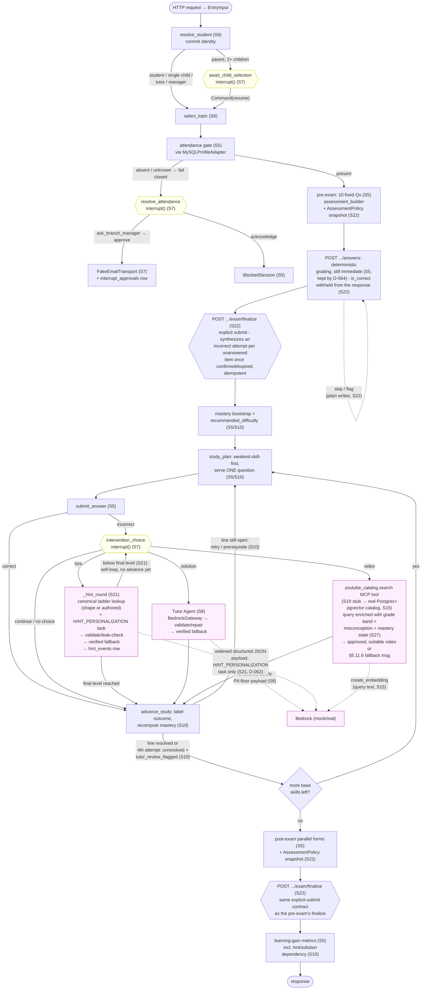
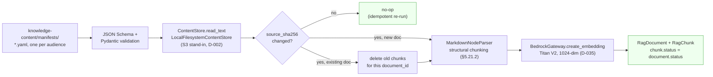
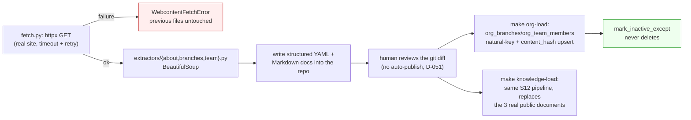
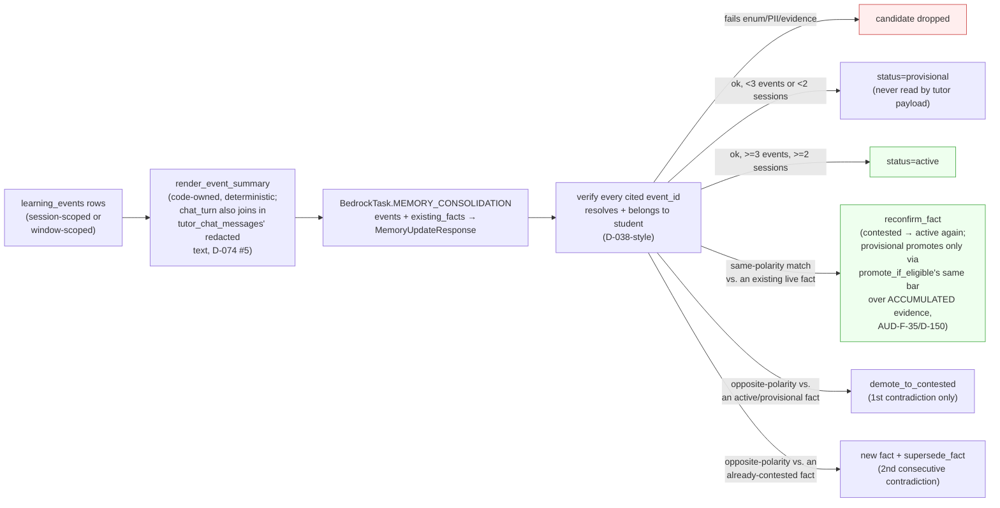
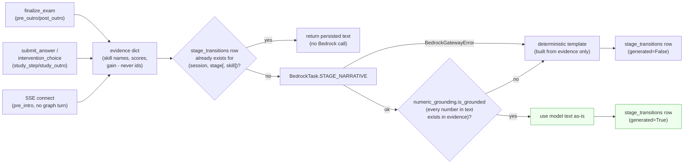
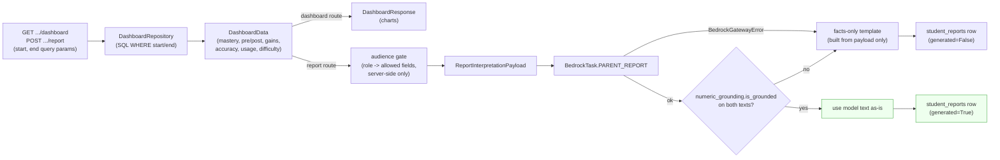

# Architecture

The system as built through **S0–S34 plus the S36–S43 audit and stabilization work and the
§2.6 launch gate** — the deterministic learning core, the S8 Bedrock gateway, the S9 AI
question-generation pipeline, the S10 adaptive mastery/retry ladder, the S11 real-time
learning frontend, S12–S13's RAG ingestion + hybrid search + Q&A graph, S14–S15's MCP tool
registry (Gmail, Calendar, Maps, YouTube), S16's chat frontend, S17–S19's real org content
and access-aware refusals, S20–S23's question bank / hint ladder / exam policy + frontend,
S24–S28's tutoring chat, memory, personalized transitions and reports, S30–S31's evaluation
platform and observability, and S32–S35's live staging deployment and pipeline. This file is
a map of *what exists now*, not the full target design — [SPEC.md](SPEC.md) is the spec,
[ROADMAP.md](ROADMAP.md) tracks what's next, and [DECISIONS.md](DECISIONS.md) records why
each non-obvious choice was made. Session provenance is tagged in each node (e.g. `(S6)`).

**Not built, with reasons rather than "later":**

- **Multimodal solution images (S29)** — deferred, not merely unbuilt: **D-078**. The one
  genuinely absent feature of the original scope.
- **The production environment (S48) and the real integration with `go.intellichoice.org`
  (S42–S47)** — staging is live and real; production and the `IcProfileAdapter` are not.
- **Independent auth, consent capture, and §5.1.2's first-visit notice (S44/S45)** — the
  apps still issue dev tokens; the notice is dispositioned to S45, not written (**T-02**,
  D-129).
- **Real Google/YouTube credentials** — `youtube-sync` now *has* a real weekly EventBridge
  schedule but ships **deliberately disabled**, because `youtube_provider` defaults to
  `fake` and an unattended run would write fabricated catalog rows on a schedule, which is
  worse than not running (D-105). `make webcontent-sync` remains manual for the same class
  of reason. The three enabled schedules — `chat-purge`, `retention-purge`,
  `memory-consolidate` — do run unattended.

**Two shipped behaviors that deviate from the plan's own recommendation**, recorded here
because reading the spec alone would mispredict the code: S22 kept **grade-on-submit** rather
than save-then-finalize, and gave pre/post exams a real default timer (a user decision against
the plan, **D-064**); and the org's local-time convention is a **provisional default with an
env switch** (`ORG_TIMEZONE`/`ORG_TIME_CONVENTION`, **D-130**) rather than a decided value,
because it belongs to the organization and has not been confirmed.

*(This paragraph was rewritten 2026-07-30. The version before it still listed memory, eval,
observability and deployment as unbuilt — all four had shipped in S25/S30/S31/S32, and the
staleness mattered: the §2.6 criterion-9 PII evidence rests on exactly the tracing and logging
this file said did not exist. A "not yet built" list is the fastest part of an architecture doc
to rot, because nothing fails when it does.)*

## Cross-cutting invariants the diagrams encode

- **PII boundary** — MySQL is the only store holding names/emails/roles/attendance;
  PostgreSQL holds `*_external_id` references only (CLAUDE.md non-negotiable #1). LLM
  payloads cross the gateway with a restricted field set (D-023/D-026). One narrow,
  documented exception: `org_branches`/`org_team_members` hold the org's own already-
  public staff bios and branch contact info (S17, D-050) - not student/parent/guardian
  PII, and explicitly allowlisted by name/column in `test_schema_purity.py` rather than
  a blanket carve-out.
  **The floor is enforced per store and verified per store, because it does not transfer**
  (D-104 §4: the S38 log scan was clean while a bearer JWT sat in every SSE span). Unit level:
  `test_schema_purity.py` (Postgres), `test_bedrock_payload_pii_floor.py` (LLM payloads),
  `test_tracing.py` (the `RedactingSpanExporter`). Live level: `make scan-traces` and
  `make scan-logs` share one positive-controlled matcher whose needles come from the fixture
  seed module, and both **fail rather than report clean** when they cannot see their window
  (D-129). Instrumentation added later re-opens the question rather than inheriting the answer.
  **Health endpoints emit no telemetry at all** (AUD-F-30, D-132), suppressed at the `/readyz`
  handler rather than per query, so the trace corpus a scan walks is now real traffic instead of
  ~97% ALB health checks — the denominator means what a reader assumes. That fix took three
  attempts and the first made volume 3.4× *worse*, because excluding a server span **orphans its
  child spans into separate root traces** rather than removing them; only re-measuring caught it.
- **Capacity scales with *simultaneous* users, not total users, and the relationship is
  measured** (D-134). Each task runs **one uvicorn worker**, so a task's throughput is bounded by
  CPU per request and cannot be bought with a bigger task past 1024 CPU units — the lever is task
  count. Measured on staging at a pinned 2 tasks: **throughput saturates at roughly 5 concurrent
  requests per task**, and beyond that added concurrency buys latency and nothing else, growing
  about **`concurrency^1.55`** (ALB p95 0.33 s at 2.5 concurrent/task against 2.98 s at 12.5).
  **So most of a loaded request is queueing, not work:** at 25 concurrent, ~89% of an answer
  request is neither SQL nor time inside the graph node, while an unloaded request spends 13.5 ms
  there in total. Two consequences worth knowing before optimising anything here: removing
  round-trips does **not** buy latency when CPU is the scarce resource (D-132 measured exactly
  that), and capacity should be planned from a target **concurrency-per-task ratio** rather than a
  task count.
- **The ratio is now priced, and the answer is that the pilot's real target is cheap while
  §6.23's 150 is not** (D-136). Interpolating ALB p95 between the only two measured arms —
  `p95 ≈ 0.31 s × (r/2.5)^1.4`, where `r` is concurrent users per task, exponent 1.37–1.45
  depending on which of A/A′ anchors the low end:

  | target `r` | p95 | tasks at 25 concurrent | tasks at 150 |
  |---|---|---|---|
  | 12.5 (**today**) | 2.95 s | **2** | 12 |
  | 10 | 2.16 s | 3 | 15 |
  | 7.5 | 1.44 s | 4 | 20 |
  | 5 | **0.82 s** | **5** | 30 |
  | 2.5 | 0.31 s | 10 | 60 |

  **Do not extrapolate outside `r` ∈ [2.5, 12.5]** — two points cannot establish a functional
  form, which is the exact error D-134's own pre-registered prediction made in the other
  direction. The headline: **at the documented pilot target of 25 concurrent, a comfortable p95
  costs three more tasks, not twenty-eight.** 2 → 5 tasks moves p95 from a 0.7%-margin 2.98 s to
  ~0.8 s.
- **Connection ceilings scale with total concurrency, not with task count — provided the pool is
  resized with it.** `create_engine`'s `pool_size=10, max_overflow=10` was sized in S34 for **one**
  process serving 150 concurrent sessions; it is a per-task constant, so multiplying tasks
  multiplies *idle pool capacity* rather than useful connections. A session holds one connection
  for its whole transaction, so the demand rule is **`pool_size ≈ target r`** (plus one psycopg
  connection per task for `AsyncPostgresSaver`). Under that rule 25 concurrent needs ~40
  connections across both services and **`db.t4g.micro`'s ~112 is sufficient**; 150 concurrent
  needs ~180 and does require a resize — 1.6× the ceiling, not the 2.8× a fixed 21-per-task
  implies. **⚠️ And a resize has lead time that is not money:** this account's Free Tier
  restrictions rejected `db.t4g.small` outright with a real `CreateDBInstance` failure in S32/D-084,
  so anything above `micro` is a prerequisite to check before it is a line item.
- **Deterministic core** — grading, attendance gating, authorization, mastery, study-plan
  selection, and question validation are code, never an LLM (non-negotiable #2). The S9 AI
  pipeline only proposes *shape keys from an allowlist*; every output is re-validated
  deterministically before persistence (D-026).
- **Authorization distinguishes reading a student's data from changing it** — every learning
  route passes a required `access: "read" | "write"` to `resolve_target_student` (S40, D-107).
  Required rather than defaulted because the recurring defect in this codebase is a route
  quietly getting the permissive branch: AUD-C-01, AUD-X-01 and AUD-X-05 were each "the one
  route nobody classified", so a new route cannot compile without answering the question. The
  tutor/branch_manager roles currently have no per-student scope check for *reads* — D-086's
  accepted risk, awaiting the assignment/branch-roster data `IcProfileAdapter` brings in S43 —
  but their *writes* fail closed, because a read gap discloses data that exists while a write
  gap fabricates data that does not, indistinguishably, into scoring and parent-visible reports.
- **A session's owner is write-once** — the routes that read `student_external_id`/
  `user_external_id` out of the checkpoint are only sound if the route that *writes* it also
  checks it, which for a long time it did not: any holder of a session id could rebind it and
  lock the owner out (S40, AUD-X-01/AUD-C-01). Identity is now never moved to a different
  subject and never downgraded to `None` by an anonymous turn. The one legitimate rebind — a
  parent switching children — goes through `await_child_selection`, which re-checks the live
  parent-child link on resume.
- **Account and consent state is checked at every authenticated entry point, not inherited** —
  SPEC §5.1.2's `account_status`/`consent_status`/`parental_consent_verified` are enforced by
  `intellichoice_shared.auth.account_refusal_reason`, called from both apps' `get_current_claims`
  **and from both SSE routes separately** (S40, D-107). The streams authenticate via `?token=`
  because `EventSource` cannot set a header, so they never pass through the dependency — the same
  split-path structure that let a bearer token reach X-Ray in AUD-F-13 while the access log stayed
  clean. **A security floor has to be re-established per entry point rather than assumed from a
  sibling.** The function returns a reason instead of raising, so the shared package carries no
  FastAPI dependency.
- **`question_variants` holds two populations and only one is comparable** — the single canonical
  rendering that *defines* a template (loader / AI pipeline, one per template) versus the runtime
  instance minted per question served. SPEC §5.8.3's dedup compares against `origin="canonical"`
  only (S40, D-106). Comparing against both made a *content* question ("is this a new question?")
  depend on a *usage* fact ("how much has the app been run?"), and the dedup population grew
  without bound with traffic — 60,906 rows against 50 templates when this was separated.
- **Spend ceilings reserve before they spend, on their own connection** — every per-day paid-API
  ceiling was `read the spend, then spend`, with the cost row committed at FastAPI dependency
  teardown *after the response*, so concurrent callers each read a stale total and ten concurrent
  reports cost **10× the ceiling** (S42, AUD-X-08, D-110 §2). A caller now reserves its worst-case
  cost in `cost_reservations` in an **immediately-committed transaction before the model call** and
  settles the real cost after, serialized by `pg_advisory_xact_lock(hashtext(scope||subject))` —
  `INSERT … SELECT` alone does not serialize under READ COMMITTED. **`CostReservationRepository` is
  the one repository bound to the session *factory* rather than to a session**, and that is the
  point: a reservation written on the request's session would be invisible to exactly the callers it
  exists to stop. Unsettled reservations stay charged at their estimate — over-counting, which is the
  safe direction for a spend control. The per-session gateway budget is *not* covered and remains
  stateless by design (D-072).
- **A paid-API call needs an *input* bound, not only spend and output bounds — and the bound must be
  sized against the timeout, not the context window** (AUD-F-34/AUD-F-36, D-141). The gateway has
  always bounded output tokens, per-call timeouts, retries, the circuit breaker and per-session spend.
  Nothing bounded how much went *in*, so `memory-consolidate` built a 215,355-token prompt from
  13,865 `learning_events` against a 200,000-token context and failed **every** call for its entire
  existence — while exiting 0, because it caught its own errors and printed a summary. Two rules came
  out of fixing it, and both generalise past this job:
  1. **Any payload assembled from an unbounded row count needs a batch bound**, expressed in the same
     serialisation the gateway sends (`model_dump_json`) so the estimate cannot drift from the payload,
     plus a **cap on calls per subject** — otherwise the fix converts one failing call into an
     unbounded number of succeeding paid ones.
  2. **The context window is usually the least binding of three constraints.** The first bound (120k
     tokens) fitted the window and still failed: 12 cents of input per call, and slower than the 20 s
     call timeout. Latency on a structured-output path tracks the **output** budget — here derived from
     a student's existing fact count — so a batch has to be sized against timeout and cost first.
- **A check that can pass over an empty corpus has to fail on the empty corpus instead** (AUD-C-17,
  D-143; earlier: AUD-F-12, D-102, D-135 §3). Four times now a green signal has meant "there was
  nothing to look at": an empty X-Ray store certified "no PII"; a log scan reported zero hits because
  it read one page; daily metric buckets offset from midnight showed a schedule that had not fired;
  and the RAG suite's one **architectural** assertion — adversarial containment, threshold 1.0 —
  passed for months because only 3 documents were effective, then failed the instant 11 more became
  effective at a date boundary. `scan_xray_pii.py` already encodes the fix for scanners (**zero traces
  scanned is an explicit FAIL**); the rule generalises to every measurement and every eval: **assert
  the denominator, not just the rate.** A suite whose green depends on the wall clock, or on a table
  being empty, is reporting its own coverage rather than the system's behaviour.
  **Now enforced in the evals too** (D-144): both Q&A coverage runners refuse to score over an empty
  effective public corpus, and the adversarial containment verdict derives its allowlist from the
  corpus at run time instead of pinning document ids, so the verdict cannot go stale at the next
  `effective_from`. The honest limit is recorded with it — a precondition catches the *empty* corpus,
  not the *sparse* one; corpus-independence by construction is what covers the sparse case.
- **A job that catches its own errors must not report success by exhaustion** (AUD-F-34, D-141 §1).
  The scheduled-job failure alarm matches `containers.exitCode: [{"anything-but": [0]}]`, so a CLI that
  swallows every failure and returns 0 is invisible in every console — which is how a job that had never
  once worked survived unnoticed until it was run by hand. Every scheduled CLI therefore owes a non-zero
  exit when its whole unit of work failed, and a summary line that distinguishes "nothing to do" from
  "nothing worked". Budget exhaustion is *not* a failure and must not trip it, or the alarm gets
  disabled within a month.
- **One attempt per exam item, enforced by the database** — `assessment_attempts` is unique on
  `(assessment_session_id, question_variant_id)`; the `Idempotency-Key` deduplicates a retry of the
  same submission and does not license a second answer (S42, AUD-L-10, D-110 §1). Scoring counts
  attempts, so a second one silently rescored a 10-item exam as 10/11. Enforced in Postgres rather
  than only in `flow` because a status check in Python is read-then-act: two concurrent answers would
  both pass it. `learning_gain`'s `max_score` is the attempt count and is the *item* count **only
  because of this constraint** — the dependency is documented at that line.
- **The checkpoint can be ahead of the database, and a session must heal rather than dead-end** —
  the LangGraph saver commits at the end of each superstep on its own psycopg pool; domain rows
  commit at dependency teardown. Anything failing in between keeps the checkpoint and discards the
  rows, and **a task stop enters that window with no bug required — ECS drains tasks on every
  deploy** (AUD-X-07). `services/checkpoint_reconcile.py` checks a checkpointed row id against the
  row it names and rolls the checkpoint *backwards* to what the database supports, never forwards by
  inventing rows; `learning_checkpoint_repairs_total` counts it, so a flat zero is the evidence the
  unfixed ordering is not being hit. **Partial: only the mid-finalize seam. The mid-interrupt seam
  and the commit ordering itself are still open** (S42, D-110 §3).
- **An SSE stream subscribes before it reads its initial snapshot, never after** (AUD-F-36, D-145) —
  both apps' `routers/stream.py` register on the in-process event bus *first*, then build the frame,
  and unsubscribe if that build fails. Reversed, an action completing during the read publishes to
  nobody **and** is too early for the queue, so the event is provably lost rather than merely missed:
  the client receives a pre-action initial frame that overwrites its own fresh POST response, and the
  connection has nothing left to say. That hung a parent's child-selection interrupt indefinitely
  with every HTTP call returning 200 and no error anywhere. The read is not instantaneous and must
  not be assumed so — S26's `pre_intro` puts a real Bedrock call inside it. "The checkpoint is read
  fresh on connect" covers events from *before* the connect, never during it.
- **External actions are interrupt-gated** — child selection, attendance emails, and the
  hint/solution/video choice each pause via LangGraph `interrupt()` and survive restart via
  the Postgres checkpointer (S7); chat-api's admin-escalation email and calendar action
  (Google Calendar / `.ics` / cancel) do the same (S14).
- **A multi-round pause loops via a graph-level self-edge, never a loop inside one node
  body** — `intervention_choice`'s within-question hint ladder (S21) needs more than one
  round of user choice on the same logical turn, but a resumed node replays its entire
  body from the top (D-021 gotcha #1), so a `while`-loop-with-`interrupt()` inside one
  node would redundantly re-run every earlier round's real Bedrock call and DB write on
  each escalation. Instead, the node stays single-`interrupt()`-per-invocation and
  `graph/build.py` routes it back to itself via a conditional edge when more rounds
  remain (`LearningState.hint_ladder_awaiting_choice`) - each round is a fresh, side-
  effect-free node execution up to its own pause (S21, D-063). This is the pattern for
  any future node needing more than one round of paused input in one turn.
- **Only Pydantic-validated tool arguments can execute** — every external side effect
  (Gmail send, Google Calendar create) goes through `McpToolRegistry.call`, which
  validates `raw_args` against the tool's own strict Pydantic model *before* the handler
  ever runs; an invalid-argument call never reaches the transport (S14, Phase 15/§6.16).
- **Dev fakes behind interfaces** — auth, MySQL, Bedrock, Gmail, and Google Calendar each
  have a dev fake as the default, with the real client env-selected (D-002).
- **Offline vs. runtime** — the curriculum loader (S4) and AI generation pipeline (S9) write
  Postgres but are never on a request path; generated candidates land as
  `validation_status="pending"` and require explicit activation to be delivered (D-026).
- **Only independent mastery counts** — a study answer that leaned on a hint, video, or
  solution never inflates bootstrap mastery; only `independent_correct` does (S10, D-029).
- **Draft content never reaches the retriever** — `rag_chunks.status` is copied from its
  document at ingestion time; every retrieval method (`search_document_chunks`,
  `hybrid_search`) hardcodes `status == "approved"`, so a draft document's chunks exist in
  Postgres (provably, via ingestion) but are structurally unreachable by any query (S12).
- **Role/branch/date filtering happens before ranking, never after** — `role_access_filter`
  builds the SPEC §5.21.3 metadata filter from the caller's *resolved* role and branch
  (never from the query text), and it is applied inside the same SQL that does keyword/
  vector search - there is no "search everything, then hide" step to get wrong (S13).
- **A citation is only trusted after code re-verifies it** — the RAG-answer model proposes
  which chunk/quote supports its answer, but `chat_api.services.qa` drops any citation
  whose quote isn't a real substring of the chunk it cites (word-exact and order-exact;
  whitespace-insensitive since D-150 — hard-wrapped source documents put newlines
  mid-sentence, AUD-C-18) before anything reaches a caller; an answer with zero surviving
  citations becomes a no-answer/escalation response instead (S13, mirrors D-024's "verify
  calculations with tools" pattern for hint/solution content).
- **Retrieved content is data, never instructions** — the Q&A graph's Scope Guard/Intent
  Router runs on the user's own query only, entirely before retrieval; document text is
  never concatenated into a system prompt, and no tool exists yet that a document's text
  could induce a call to (S13, SPEC §5.30.4).
- **Consent precedes location collection, and the location itself never reaches a
  checkpointed field** — `branch_locator_consent` pauses via `interrupt()` with the
  static §5.1.3 notice *before* any ZIP/city/address/coordinates are read; the caller
  supplies the actual location only in the same `/respond` call as their approval, used
  once inside that node's own function body and never assigned to a `QAState` field
  (S15, D-045).
- **Internal, no-side-effect MCP tools needing a request-scoped dependency use a
  throwaway registry, not the shared one** — `youtube_catalog.search`'s handler closes
  over the current request's own `YoutubeRepository`/embedding call, so it's registered
  on a fresh `McpToolRegistry()` built inside `video_catalog.search_video` itself,
  avoiding a registration race between concurrent requests on the shared, long-lived
  `app.state.mcp_registry` (S15, D-047).

## 1. System architecture

```mermaid
flowchart TB
    subgraph EXT["External systems — all dev fakes behind interfaces (D-002)"]
        AUTH["go.intellichoice.org auth<br/>FakeTokenIssuer / JWT (S2)"]
        MYSQL[("MySQL 8.4<br/>PII source of truth (S1/S2, MySQL since<br/>D-082/D-083 - originally built Mongo-<br/>shaped)<br/>names, emails, roles,<br/>parent–child links, attendance")]
        BEDROCK["AWS Bedrock<br/>Mock / Anthropic provider (S8)<br/>+ Titan embeddings (S12)"]
        GMAIL["Gmail MCP<br/>FakeEmailTransport (S7)<br/>via McpToolRegistry (S14)"]
        GCAL["Google Calendar MCP<br/>FakeCalendarTransport (S14)<br/>via McpToolRegistry"]
        GMAPS["Google Maps MCP<br/>FakeMapsProvider (S15)<br/>via McpToolRegistry"]
        YTAPI["YouTube Data API<br/>FakeYoutubeProvider default;<br/>YoutubeDataApiProvider (S27,<br/>unexercised) - offline sync worker only"]
    end

    subgraph WEB["apps/learning-web :5173 (S11)"]
        REACT["React + Vite, no state library<br/>useLearningSession hook<br/>REST actions + EventSource stream"]
    end

    subgraph CWEB["apps/chat-web :5173 (S16)<br/>(same default Vite port as<br/>learning-web - run one at a time,<br/>or override --port)"]
        CREACT["React + Vite, no state library<br/>useChatSession hook<br/>client-built ChatTurn transcript (D-048)<br/>REST actions + EventSource stream"]
    end

    UIBRAND["packages/ui-brand (S22.5, D-065)<br/>CSS/assets only, not a uv workspace<br/>member (pyproject.toml exclude)<br/>tokens.css · base.css ·<br/>logo/favicon assets · check_contrast.py"]

    subgraph APPS["FastAPI apps (S1)"]
        subgraph LAPI["learning-api :8001"]
            LROUTES["routers/sessions (S5–S7)<br/>routers/questions (S9)<br/>routers/stream, routers/students (S11)<br/>/healthz (liveness-only), /readyz<br/>(DB-aware, ALB target-group health<br/>check since S34) (S1/S34)"]
            LAUTH["auth deps<br/>audience=learning (S2)<br/>+ dev-only /dev/token (S11)"]
            GRAPH["LangGraph workflow (S6–S8)<br/>see diagram 2"]
            LSVC["services: attendance, grading,<br/>assessment_builder, mastery_bootstrap,<br/>study_plan, learning_gain, flow (S5)<br/>tutor, topic_resolver (S8)<br/>question_reports (S9)<br/>study_outcomes (S10)<br/>video_catalog: real Postgres+<br/>Bedrock catalog (S10 stub → S15)<br/>session_events, history (S11)<br/>tutor.generate_personalized_hint,<br/>topic_resolver.resolve_misconception_tag<br/>(S21)<br/>memory_events (6 emission points),<br/>tutor.py/tutor_chat.py/study_plan.py<br/>read `relevant_learning_fact`/<br/>weak_skill tie-break (S25)"]
        end
        subgraph CAPI["chat-api :8002"]
            CROUTES["/healthz (liveness-only), /me<br/>(S1/S2)<br/>/readyz (DB-aware, ALB target-group<br/>health check since S34) (S34)<br/>routers/sessions incl. /respond,<br/>routers/stream (S13/S14)"]
            CAUTH["auth deps<br/>audience=chat (S2)<br/>optional/anonymous claims (S13)<br/>+ dev-only /dev/token (S16)"]
            QGRAPH["QAState graph (S13/S14/S15)<br/>see diagram 5"]
            CSVC["services: role_access,<br/>qa (citation grounding),<br/>session_events (S13)<br/>admin_escalation, calendar,<br/>rate_limit (S14)<br/>branch_locator (S15)"]
        end
    end

    subgraph PKGS["Workspace packages"]
        SHARED["packages/shared<br/>auth + profile DTOs (S2)<br/>bedrock schemas (S8/S9/S13/S14/S15/S21/S24)<br/>email schemas (S7)<br/>calendar schemas, mcp registry (S14)<br/>maps, youtube schemas (S15)<br/>HintPersonalizationPayload/Response (S21)<br/>LearningChatIntent/TutorChatPayload,<br/>pii_redaction (S24, D-072)"]
        ADAPT["packages/adapters<br/>JwtTokenVerifier (S2)<br/>MySQLProfileAdapter (S2, D-083)<br/>ResilientBedrockGateway (S8)<br/>FakeEmailTransport (S7)<br/>FakeCalendarTransport, ics (S14)<br/>FakeMapsProvider,<br/>FakeYoutubeProvider (S15)<br/>YoutubeDataApiProvider,<br/>httpx-based (S27, unexercised)"]
        DB["packages/db (S3)<br/>28 SQLAlchemy models · repositories<br/>hybrid_search + RRF (S13)<br/>mcp_tool_calls (S14)<br/>youtube_videos + search_catalog (S15)<br/>question_validation_runs (S20)<br/>hint_events (S21)<br/>tutor_chat_messages (S24)<br/>learning_events, semantic_memory +<br/>superseded_by_id/contradicts_event_count<br/>(S25)<br/>youtube_videos: prerequisite_skill_ids,<br/>transcript/license/suitability_status,<br/>verification_failures (S27)<br/>async Alembic migrations"]
        CURR["packages/curriculum<br/>taxonomy · shape registry ·<br/>variant gen · §5.8.5 validation (S4)<br/>ai_pipeline · settings (S9)<br/>authored_validation · review_cli<br/>(S20, sympy independent solve)<br/>hint_ladders: 11 hand-authored<br/>canonical shape ladders (S21)"]
        KNOW["packages/knowledge<br/>manifest validation ·<br/>ContentStore · chunking ·<br/>ingest pipeline (S12)<br/>retrieval: embed→search→rerank<br/>→drop score=0 (S13/S17)"]
        YT["packages/youtube (S15)<br/>classify: re-validate against<br/>curriculum registry (D-046)<br/>catalog_sync · sync_cli<br/>channel-pin filter, prerequisite<br/>derivation, verification pass (S27)"]
        WEB["packages/webcontent (S17)<br/>fetch (real live site, D-051) ·<br/>extractors (about/branches/team) ·<br/>render · org_load · sync_cli"]
        MEM["packages/memory (S25)<br/>consolidation.py: session-scoped +<br/>weekly-window entrypoints, one<br/>shared core · events.py (emit/<br/>render vocabulary) · consolidate_cli"]
        EVALS["packages/evals (S30, S37)<br/>registry.py: SPEC §5.31 category→<br/>test-file index, not a reimplementation<br/>· llm_judge.py: BedrockTask.LLM_JUDGE's<br/>first caller, judge model ≠ production<br/>answerer · leak_sample.py: golden<br/>fixture reusing curriculum's leak<br/>checks (found/fixed D-079)<br/>· qa_coverage.py (S37): pure scoring for<br/>the Q&A coverage eval, shared by the<br/>mock CI gate and the paid real-Bedrock<br/>run so both compute the same metric<br/>test-time only, no runtime caller"]
    end

    subgraph OFFLINE["Offline pipelines (not request paths)"]
        LOADER["curriculum loader (S4)<br/>make curriculum-load"]
        AIPIPE["AI generation pipeline (S9)<br/>make question-gen-run<br/>Generator→SolverA/B→3 Reviewers→<br/>validate→dedup→pending<br/>+ authored mode (S20)<br/>make question-gen-authored /<br/>make question-review"]
        KLOAD["RAG ingestion (S12)<br/>make knowledge-load<br/>manifest→chunk→embed→pgvector"]
        YTSYNC["YouTube catalog sync (S15)<br/>make youtube-sync<br/>fetch→classify→embed→upsert→<br/>mark-missing-inactive"]
        WEBSYNC["Real org content sync (S17)<br/>make webcontent-sync (fetch→extract→<br/>write, human review) then<br/>make org-load / make knowledge-load"]
        MEMSYNC["Weekly memory consolidation (S25)<br/>make memory-consolidate<br/>per-student window→aggregate→<br/>MEMORY_CONSOLIDATION→validate→upsert"]
    end

    subgraph STORES["Data stores (S1)"]
        PG[("PostgreSQL 16 + pgvector<br/>domain tables (S3)<br/>checkpoints (S6)<br/>interrupt_approvals, now<br/>app-agnostic via source_app (S7/S14)<br/>mcp_tool_calls audit trail (S14)<br/>question_templates/variants,<br/>problem_reports (S3/S9)<br/>question_templates.authoring_mode +<br/>authored columns, stem_embedding,<br/>question_validation_runs (S20)<br/>rag_documents/rag_chunks,<br/>1024-dim embeddings (S12)<br/>youtube_videos, 1024-dim<br/>embeddings (S15)<br/>org_branches/org_team_members,<br/>real public content, narrow<br/>denylist exemption (S17, D-050)<br/>org_events, real event history<br/>(S18)<br/>chat_suggestions, hand-authored<br/>welcome/follow-up prompts (S19,<br/>D-057)<br/>hint_events, per-level ladder<br/>audit trail (S21)<br/>tutor_chat_messages, redacted<br/>chat turns, 90-day retention<br/>(S24, D-072)<br/>otherwise NO PII — external ids only")]
        KCONTENT[("knowledge-content/ (S12/S17)<br/>manifests + 23 docs (20 placeholder<br/>+ 3 real public, S17) + structured/<br/>local FS stands in for S3<br/>approved/ (SPEC §5.20.3)")]
    end

    REACT -->|"REST actions +<br/>GET .../stream (SSE, S11)"| LROUTES
    CREACT -->|"REST actions +<br/>GET .../stream (SSE, S16)"| CROUTES
    REACT -->|"relative import,<br/>vite server.fs.allow"| UIBRAND
    CREACT -->|"relative import,<br/>vite server.fs.allow"| UIBRAND

    LAUTH --> ADAPT
    LROUTES --> LSVC
    LROUTES --> GRAPH
    GRAPH --> LSVC
    LSVC --> DB
    LSVC --> ADAPT
    CROUTES --> CAUTH
    CAUTH --> ADAPT
    CROUTES --> CSVC
    CROUTES --> QGRAPH
    QGRAPH --> CSVC
    CSVC --> DB
    CSVC --> KNOW
    QGRAPH --> ADAPT

    ADAPT --> SHARED
    DB --> SHARED
    CURR --> DB
    CURR --> SHARED
    CURR --> ADAPT
    KNOW --> DB
    KNOW --> SHARED
    KNOW --> ADAPT
    YT --> DB
    YT --> SHARED
    YT --> ADAPT
    YT --> CURR
    MEM --> DB
    MEM --> SHARED
    MEM --> ADAPT
    LSVC -->|"finalize_exam: inline<br/>session-scoped consolidation"| MEM
    EVALS --> SHARED
    EVALS --> ADAPT
    EVALS --> CURR

    ADAPT --> AUTH
    ADAPT --> MYSQL
    ADAPT --> BEDROCK
    ADAPT --> GMAIL
    ADAPT --> GCAL
    ADAPT --> GMAPS
    ADAPT --> YTAPI

    DB --> PG
    GRAPH -->|"AsyncPostgresSaver<br/>checkpoints (S6)"| PG
    QGRAPH -->|"AsyncPostgresSaver<br/>checkpoints (S13)"| PG

    LOADER --> CURR
    LOADER --> PG
    AIPIPE --> CURR
    AIPIPE --> ADAPT
    AIPIPE --> PG
    KLOAD --> KNOW
    KLOAD --> ADAPT
    KLOAD --> PG
    YTSYNC --> YT
    YTSYNC --> ADAPT
    YTSYNC --> PG
    KNOW --> KCONTENT
    MEMSYNC --> MEM
    MEMSYNC --> ADAPT
    MEMSYNC --> PG

    classDef ext fill:#fde,stroke:#b47
    classDef offline fill:#eef,stroke:#66a
    classDef store fill:#efe,stroke:#4a4
    class AUTH,MYSQL,BEDROCK,GMAIL,GCAL,GMAPS,YTAPI ext
    class LOADER,AIPIPE,KLOAD,YTSYNC,MEMSYNC offline
    class PG,MYSQL,KCONTENT store
```



## 2. Learning request flow (LangGraph workflow, S5–S10; video option updated S15; exam
finalize updated S22)



`finalize_exam` never calls `interrupt()` (deterministic, no human approval involved) -
shown as a hexagon above only to mirror the "distinct explicit action" shape of the real
interrupt nodes, not because it pauses.

**S24 contextual chat (`POST .../chat`, `learning_api.services.tutor_chat` +
`graph/nodes.py::run_chat_turn`) deliberately sits *outside* this graph entirely** - not
shown as a node above because it isn't one. It's most often used exactly while paused at
`IC`'s `intervention_choice` `interrupt()` (the button-panel `AssistancePanel` shown there
is where the chat UI lives too), and both a fresh `graph.ainvoke` and `graph.aupdate_state`
were confirmed (D-073) to silently discard that pending interrupt - so chat reads state via
a plain peek (no pending-interrupt guard) and calls `run_chat_turn` as an ordinary async
function, never through the graph. Three of its six intents reuse `HINT2`/`TUTOR`/`VID`'s
own generation logic directly (same functions, called from outside the graph this once);
the other three add two new Bedrock tasks (`LEARNING_CHAT_INTENT` for classification,
`TUTOR_CHAT` for free replies) plus a PII-redaction pass (D-072) and a self-harm keyword
screen ahead of any Bedrock call.

## 3. AI question-generation pipeline (S9, offline)

Runs via `make question-gen-run`; never on a request path. A candidate that fails *any*
stage is recorded `rejected` and never delivered; one that passes every stage lands
`pending` and needs explicit `activate_template` to become `approved` + deliverable.

```mermaid
flowchart LR
    TOPIC["topic + difficulty"] --> GEN["Generator Agent (S9)<br/>picks shape key from<br/>difficulty allowlist"]
    GEN --> VG["deterministic variant gen<br/>+ §5.8.5 validation (S4)"]
    VG --> DEDUP["dedup vs. all<br/>persisted variants"]
    DEDUP --> SA["Solver A"]
    SA --> SB["Solver B"]
    SB --> AGREE{"A = B = deterministic<br/>correct_option?"}
    AGREE -->|"no"| REJ["validation_status=rejected<br/>(kept, never delivered)"]
    AGREE -->|"yes"| DIFF["Difficulty Reviewer"]
    DIFF --> AMB["Ambiguity Reviewer"]
    AMB --> ALI["Alignment Reviewer"]
    ALI -->|"any flag"| REJ
    ALI -->|"all pass"| PEND["validation_status=pending<br/>active_status=active"]
    PEND -->|"activate_template (human gate)"| APPROVED["validation_status=approved<br/>→ deliverable"]

    classDef reject fill:#fee,stroke:#c44
    classDef ok fill:#efe,stroke:#4a4
    class REJ reject
    class PEND,APPROVED ok
```



### 3b. Authored question bank pipeline (S20, offline)

`generate_authored_candidate` (`ai_pipeline.py`) - a second mode alongside 3's shape
pipeline, `authoring_mode="authored"`: a real hand-quality stem/hint-ladder/solution
instead of a parameterized template, `linear_equations` only (D-060). Runs via `make
question-gen-authored`; human review via `make question-review` (`review_cli.py`) -
approve/reject/edit-and-rerun, still gated by the same `activate_template` (D-026
unchanged). Every attempt - rejected or not - gets one append-only
`question_validation_runs` row (D-059).

```mermaid
flowchart LR
    TOPIC2["topic + difficulty<br/>(linear_equations only)"] --> AGEN["Authored Generator Agent (S20)<br/>BedrockTask.<br/>AUTHORED_QUESTION_GENERATION"]
    AGEN --> AGATE["deterministic gate<br/>(authored_validation.py)<br/>schema/markdown · SymPy solve ·<br/>leakage · ladder monotonicity ·<br/>hint/solution agreement ·<br/>readability"]
    AGATE -->|"fail"| AREJ["rejected<br/>(question_validation_runs row,<br/>no template row)"]
    AGATE -->|"pass"| ADEDUP["exact-text dedup +<br/>stem_embedding near-dup<br/>(cosine distance, D-061)"]
    ADEDUP -->|"near-dup"| AREJ
    ADEDUP -->|"ok"| ASA["Solver A<br/>(QUESTION_GENERATION slot)"]
    ASA --> ASB["Solver B<br/>(QUESTION_REVIEW slot,<br/>different model, D-059)"]
    ASB -->|"disagree"| AREJ
    ASB -->|"agree"| JUDGE["QUESTION_JUDGE (S20)<br/>difficulty/ambiguity/alignment/<br/>age-appropriate/hint quality"]
    JUDGE -->|"flagged or low score"| AREJ
    JUDGE -->|"borderline score"| APEND2["pending,<br/>review_priority=high"]
    JUDGE -->|"clean pass"| APEND["pending,<br/>review_priority=normal"]
    APEND2 --> AREVIEW["review_cli.py (human gate)"]
    APEND --> AREVIEW
    AREVIEW -->|"approve"| AAPPROVED["approved → deliverable<br/>(same get_active_questions<br/>runtime query as shape items)"]
    AREVIEW -->|"reject"| AREJECTED["rejected"]
    AREVIEW -->|"edit-and-rerun"| ASUPER["superseded (kept)<br/>→ new candidate at version+1"]

    classDef reject fill:#fee,stroke:#c44
    classDef ok fill:#efe,stroke:#4a4
    class AREJ,AREJECTED reject
    class APEND,APEND2,AAPPROVED ok
```



## 4. RAG content ingestion pipeline (S12, offline)

Runs via `make knowledge-load`; never on a request path. Keyed by `source_sha256` under
each manifest entry's `document_id` (a natural key, D-016's pattern) - unchanged content
is a no-op, changed content replaces that document's chunks in place. `status` (draft vs.
approved) is copied onto every chunk it produces, which is what makes a draft document's
chunks provably unreachable by `search_document_chunks` (Phase 13's completion criterion)
without any extra filtering logic in the pipeline itself.



## 5. Q&A request flow (QAState graph, S13/S14/S15)

One HTTP request per turn, one `ainvoke` call. Three intents now pause via `interrupt()`
(`admin_escalation`, `calendar_action` - S14; `branch_locator_consent` - S15), resumed
via `POST .../respond` + `Command(resume=...)`, mirroring `learning-api`'s S7 pattern.
Anonymous callers are a first-class case (`claims` may be `None`), unlike `learning-api`.

```mermaid
flowchart TB
    START([HTTP request → AskInput]) --> RR["resolve_role (S13)<br/>claims → user_role/branch<br/>(anonymous → \"public\")"]
    RR --> SG["scope_guard (S13)<br/>one combined Bedrock call:<br/>BedrockTask.SCOPE_AND_INTENT"]

    SG -->|"out_of_scope"| REFUSE["refuse (S13)<br/>§5.19.4 verbatim message"]
    SG -->|"in_scope,<br/>intent=clarification"| UNAVAIL["unavailable_intent (S13)<br/>generic rephrase message"]
    SG -->|"in_scope,<br/>intent=document_qa"| DOCQA["answer_document_qa (S13)"]
    SG -->|"in_scope,<br/>intent=admin_contact"| PREP["prepare_admin_escalation (S14)<br/>rate limit + deterministic<br/>draft (no LLM call)"]
    SG -->|"in_scope,<br/>intent=calendar"| CEXT["calendar_extract (S14)<br/>retrieve() + BedrockTask.<br/>CALENDAR_EXTRACTION"]
    SG -->|"in_scope,<br/>intent=branch_locator"| BLC{{"branch_locator_consent<br/>interrupt() (S15)<br/>§5.1.3 notice, no location<br/>read yet"}}

    DOCQA["answer_document_qa (S13)<br/>retrieval only (S19 split)"] --> FILTER["role_access_filter (S13)<br/>audiences=[public,role]<br/>+ branch + as_of<br/>— applied BEFORE search"]
    FILTER --> HYBRID["RagRepository.hybrid_search<br/>FTS + pgvector + RRF (S13)"]
    HYBRID --> RERANK["BedrockTask.RERANK (S13)<br/>top-30 → top 5-8,<br/>score=0 dropped (D-052)"]
    RERANK -->|"chunks empty"| ACCESS["explain_access (S19)<br/>count_matching_by_audience<br/>probe, no LLM, no chunk<br/>content — role-gated only<br/>(D-056)"]
    RERANK -->|"chunks non-empty"| SYNTH["synthesize_answer (S13/S19)<br/>BedrockTask.RAG_ANSWER,<br/>untrusted context, never<br/>a system instruction (§5.30.4)"]
    SYNTH --> VERIFY{"qa.answer_question (S13)<br/>quote a real substring?<br/>confidence ≥ threshold?<br/>sources_conflict?"}
    VERIFY -->|"no citation survives /<br/>low confidence / conflict"| NOANS["no-answer + escalation<br/>(§5.21.8, §5.29)"]
    VERIFY -->|"yes"| GROUNDED["GroundedAnswer<br/>+ verified Citations"]
    ACCESS -->|"higher-tier<br/>audience match"| HINT["access_hint<br/>(§18-C3, fixed message,<br/>never chunk content)"]
    ACCESS -->|"no match anywhere"| NOANS

    PREP -->|"rate limited"| BLOCKED["admin_escalation_blocked (S14)"]
    PREP -->|"allowed"| AESC{{"admin_escalation<br/>interrupt() (S14)"}}
    AESC -->|"Command(resume:<br/>approved)"| ESEND["McpToolRegistry.call<br/>gmail.send_email<br/>+ interrupt_approvals row"]
    ESEND -->|"McpToolError"| EFAIL["EMAIL_FAILED_MESSAGE<br/>(§5.29 preserve draft)"]

    CEXT -->|"D-038: re-derive<br/>source_document_id/page<br/>from the real chunk row"| CROUTE{"event found +<br/>validate_event ok?"}
    CROUTE -->|"no"| NOEVENT["calendar_no_event (S14)<br/>§5.29 do not guess"]
    CROUTE -->|"yes"| CACT{{"calendar_action<br/>interrupt() (S14)"}}
    CACT -->|"Command(resume:<br/>choice=google)"| GCREATE["McpToolRegistry.call<br/>calendar.create_event"]
    GCREATE -->|"McpToolError"| GFAIL["generate_ics fallback<br/>(§5.29 verbatim)"]
    CACT -->|"Command(resume:<br/>choice=ics)"| ICS["generate_ics (S14)<br/>RFC 5545, no MCP call"]
    CACT -->|"Command(resume:<br/>choice=cancel)"| CCANCEL["no external action"]

    BLC -->|"Command(resume:<br/>approved=false)"| LDECL["LOCATION_DECLINED_MESSAGE (S15)"]
    BLC -->|"Command(resume:<br/>approved=true,<br/>location fields)"| LOCFIND["find_nearest_branches (S15)<br/>location read here only,<br/>never assigned to QAState"]
    LOCFIND -->|"no usable<br/>location"| LMISS["LOCATION_MISSING_MESSAGE<br/>(§5.22 ask for ZIP/city)"]
    LOCFIND -->|"maps.geocode fails"| LUNAVAIL["branch address list only<br/>(§5.22 Maps unavailable)"]
    LOCFIND -->|"maps.compute_routes<br/>fails per branch"| LESTIMATE["haversine_km estimate,<br/>flagged is_estimate=True<br/>(§5.22 Route unavailable)"]
    LOCFIND -->|"ok"| LSORTED["branches sorted<br/>nearest-first"]

    REFUSE --> END([response])
    UNAVAIL --> END
    NOANS --> END
    HINT --> END
    GROUNDED --> END
    BLOCKED --> END
    ESEND --> END
    EFAIL --> END
    NOEVENT --> END
    GCREATE --> END
    GFAIL --> END
    ICS --> END
    CCANCEL --> END
    LDECL --> END
    LMISS --> END
    LUNAVAIL --> END
    LESTIMATE --> END
    LSORTED --> END

    classDef llm fill:#fef,stroke:#a4a
    classDef reject fill:#fee,stroke:#c44
    classDef interrupt fill:#ffe,stroke:#cc0
    class SG,RERANK,SYNTH,CEXT llm
    class REFUSE,NOANS reject
    class AESC,CACT,BLC interrupt
```

## 6. YouTube catalog sync pipeline (S15, offline; hardened S27)

Runs via `make youtube-sync` (manual trigger this session; a weekly EventBridge
schedule is later infra work); never on a learning-time request path - the video option
only ever reads the already-synced `youtube_videos` table via
`youtube_catalog.search`. A fetch failure aborts before any write, so SPEC §6.17
"keeps the previous catalog on failure" holds. S27 added a real `YoutubeDataApiProvider`
(httpx-based) behind the same Protocol - unexercised, no real YouTube Data API key
exists yet (D-002); `FakeYoutubeProvider` stays the dev/test default. S27 also added a
sync-layer channel-ID pin (never trusts the provider's own filtering, D-076 #1) and a
post-upsert verification pass (one combined `videos.list` call for liveness + license +
caption availability, D-076 #2) that never undoes an otherwise-successful sync.

```mermaid
flowchart LR
    FETCH["YoutubeProvider.list_uploaded_videos<br/>(FakeYoutubeProvider default;<br/>YoutubeDataApiProvider, S27,<br/>unexercised)"] -->|"failure"| ABORT["YoutubeSyncError<br/>previous catalog untouched"]
    FETCH -->|"ok"| PIN["channel-ID pin (S27)<br/>reject items whose own<br/>channel_id != requested"]
    PIN --> CLASSIFY["BedrockTask.VIDEO_CLASSIFICATION<br/>(S15) - model picks from the<br/>real curriculum topic/skill menu"]
    CLASSIFY --> REVALID["re-validate every proposed<br/>name against load_curriculum()<br/>(D-046, D-038-style)"]
    REVALID --> PREREQ["prerequisite_skill_ids (S27)<br/>deterministic: CurriculumContent.<br/>prerequisite_for(skill_id), no LLM"]
    PREREQ --> EMBED["BedrockGateway.create_embedding<br/>title+description, 1024-dim"]
    EMBED --> UPSERT["YoutubeRepository.upsert_video<br/>natural key = youtube_video_id"]
    UPSERT --> INACTIVE["mark_inactive_except<br/>(channel_id, seen_ids)<br/>never deletes"]
    INACTIVE --> VERIFY["get_video_details (S27)<br/>gone/private → inactive +<br/>verification_failures++<br/>reversible on recovery"]

    classDef terminal fill:#efe,stroke:#4a4
    classDef reject fill:#fee,stroke:#c44
    class INACTIVE,VERIFY terminal
    class ABORT,PIN reject
```



## 7. Real org content sync pipeline (S17, offline)

Two manual steps, `make webcontent-sync` then (after human review of the git diff)
`make org-load`/`make knowledge-load`; never on a request path. Unlike every other
external dependency in this project (D-002), there is no local fake for the fetch step -
`intellichoice.org` is a real, live nonprofit's website (D-051), and the sync CLI always
hits it for real. Extractor *unit tests* still use small offline golden-HTML fixtures.



## 8. Memory consolidation pipeline (S25, inline + offline)

Two triggers share one core (`_consolidate_events`): `graph/nodes.py::finalize_exam`
calls `consolidate_student_session` inline, right after a post-exam completes (every
event this one graph thread produced); `make memory-consolidate` calls
`consolidate_student_window` over a rolling 7-day window for every student with recent
activity (SPEC §5.15.4's weekly Sunday job - manual trigger only this session, same
"schedule later" posture as `youtube-sync`/`webcontent-sync`). Deterministic code
renders each `learning_events` row into a citable one-line summary *before* the model
ever sees it; the model only ever proposes candidate facts citing `event_id`s it was
shown, and code re-verifies every citation before trusting it (D-038-style).



## 9. Personalized stage narratives (S26, inline + SSE connect)

One entrypoint (`services/stage_narrative.py::generate_stage_narrative`), five call
sites: `graph/nodes.py::finalize_exam` (`pre_outro`/`post_outro`, cost folds into the
checkpoint's `bedrock_spend_cents` like S25's memory consolidation), `submit_answer`/
`intervention_choice` (`study_step`/`study_outro`, via a shared `_fire_study_transition_
narrative` helper keyed off `flow.AnswerResult.new_target_skill_id`), and `routers/
stream.py`'s SSE connect path (`pre_intro`, the one moment outside a graph turn - its
cost is recorded only on its own `stage_transitions` row, not the checkpoint). Each call
site builds its own evidence dict from already-resolved names/numbers (skill *names*,
never ids); `intellichoice_shared.numeric_grounding.is_grounded` re-checks every number
in the model's output against that same evidence after the call, and a deterministic
Python template (built from the identical evidence) stands in on either a gateway
failure or a failed grounding check - so a fallback narrative is grounded by
construction. Idempotent per (session, stage[, skill]) via `StageTransitionRepository.
get_for_session_stage`, checked before ever calling Bedrock.



## 10. Progress dashboard and student report (S28, pure aggregation + inline Bedrock call)

Two independent paths sharing one date-range-filtered aggregation layer
(`DashboardRepository` in `packages/db`, pushed-into-SQL `[start, end)` filters, no LLM):
`services/dashboard.py::build_dashboard` shapes the filtered rows into chart DTOs
(mastery by skill, pre/post accuracy by skill, gains over time, accuracy trend, difficulty
progression, hint/solution/video usage) - always available, cheap, deterministic.
`services/report.py::generate_student_report` reuses the same `DashboardData` plus top
semantic-memory facts to build one `ReportInterpretationPayload`, audience-gated
server-side from the caller's role (`student`/`parent`/`tutor`/`branch_manager` - never a
request field, D-077 #1) before the one `BedrockTask.PARENT_REPORT` call. Grounding and
fallback follow the same pattern S26 established: `numeric_grounding.is_grounded` checks
both `interpretation_text` and `recommendations_text` against the payload, and a
deterministic facts-only template (built from the identical payload) stands in on either a
gateway failure or a failed check - `student_reports.generated=False` marks the fallback
case. Unlike `stage_transitions`, `student_reports` is not idempotency-keyed - report
generation is an explicit on-demand action, so every call persists a fresh row (history,
newest first).



## Storage split

| Concern | Store | Notes |
|---|---|---|
| Names, emails, roles, parent–child links, attendance, branch-manager email, branch address/coordinates | **MySQL 8.4** | Read-only via `MySQLProfileAdapter`; PII source of truth (S2); branch `address`/`latitude`/`longitude` added S15 (public org facts, not PII). Originally built Mongo-shaped on a wrong assumption about `go.intellichoice.org`'s real database engine; corrected and the dev-fake rewritten MySQL-shaped in D-082/D-083 |
| Curriculum, question templates/variants, assessments, mastery, study, learning gain, blocked sessions, problem reports | **PostgreSQL 16** | External-id references only, no PII (S3/S4/S9). `study_items`/`study_attempts` gained retry-ladder columns (`target_skill_id`, `is_remediation`, `outcome_label`, `tutor_review_flagged`, ...) in S10; `learning_gain` gained `study_session_id`/`topic_id` in S11 so `services/history.py` can reconstruct a completed session's full history (no `LearningSession` grouping table exists post-S6); `assessment_sessions` gained `topic_id`/`policy`/`time_limit_seconds`/`finalized_at` and a new `assessment_item_state` table (unseen/answered/skipped/flagged nav bookkeeping) in S22 - grading itself stayed on the existing `assessment_attempts` path (D-064), `assessment_item_state` is nav/timer bookkeeping only, never a second source of truth for correctness |
| LangGraph checkpoints, interrupt approvals, MCP tool-call audit trail | **PostgreSQL 16** | `AsyncPostgresSaver` (S6); `interrupt_approvals` is app-agnostic since S14 (`session_id`/`source_app`, D-043) - learning-api's payloads stay id-only (D-020), chat-api's `email_draft`/`calendar_event` checkpoint directly since neither carries MySQL PII (D-044), and `location_consent` never checkpoints the raw location at all (S15, D-045); `mcp_tool_calls` is the §6.16 audit trail (S14, no PII), also covers `maps.geocode`/`maps.compute_routes`/`youtube_catalog.search` (S15) |
| RAG documents + chunks + embeddings | **PostgreSQL 16 + pgvector** | Populated by `make knowledge-load` (S12); 1024-dim Titan V2 embeddings (D-035); GIN index on `search_vector` + HNSW `vector_cosine_ops` index on `embedding` + composite btree pre-filter index (S13); queried via `RagRepository.hybrid_search` (FTS + pgvector + RRF) |
| YouTube video catalog + embeddings | **PostgreSQL 16 + pgvector** | Populated by `make youtube-sync` (S15); `youtube_videos` - natural-key (`youtube_video_id`) upsert, 1024-dim Titan V2 embeddings, `topic_ids`/`skill_ids` re-validated against the real curriculum registry before storage (D-046); queried via `YoutubeRepository.search_catalog` (metadata filter, then a Python-side cosine rank over the filtered set - no JSONB containment operators needed for a small catalog) |
| Real org branch directory + team roster | **PostgreSQL 16** | Populated by `make org-load` (S17); `org_branches`/`org_team_members` - natural-key (`branch_external_id`/`team_member_id`) upsert via `content_hash`, never deletes (missing-from-latest-sync → `status: inactive`, mirrors `YoutubeVideo.active_status`). `name`/`address`/`phone`/`email` are an explicit, narrow schema-purity denylist exemption (D-050) - the org's own already-public staff bios/branch contact info, not student/parent PII |
| Placeholder document source content | **`knowledge-content/` (repo, local FS)** | Stands in for S3's `approved/` prefix (SPEC §5.20.3); 23 docs across 5 audience manifests (22 synthetic + `public-our-team` real, S17), 3 deliberately `status: draft`. 3 public docs (`organization-overview`/`branch-directory`/`our-team`) now carry real content and `effective_from: 2026-07-18`; the other 20 stay synthetic/`2026-08-01` until later sessions replace them |
| Real org content extraction source | **`knowledge-content/structured/` (repo, local FS)** | Written by `make webcontent-sync` (S17) - `branches.yaml`/`team.yaml`, source_url + content_hash + extracted_at per record; human-reviewed before `make org-load`/`make knowledge-load` run (no auto-publish, D-051) |
| Per-day paid-API spend reservations | **PostgreSQL 16** | `cost_reservations` (S42, AUD-X-08/D-110 §2) - `scope`/`subject_external_id`/`reserved_cents`/`actual_cents`, external ids and a fixed enum of surface names only, no PII. Written by `CostReservationRepository`, the one repository bound to the session **factory** rather than a session, because a reservation has to commit *before* the model call returns while the request's own session commits only at dependency teardown. Serves both per-day ceilings (student report, tutor chat); `student_reports.cost_cents`/`tutor_chat_messages.cost_cents` remain the per-row audit record but no longer feed any ceiling - the two `get_spend_cents_since` readers that did were deleted, since a spend reader no ceiling consults is how the next ceiling gets wired to the wrong source |
| Chat welcome/follow-up suggestion catalog | **PostgreSQL 16** | Populated by `make chat-suggestions-load` (S19, `chat_suggestions` - id/role_audience/category/prompt_text/sort_order/active); hand-authored reference data, not scraped - upsert-by-id, no `content_hash`/inactive-marking (D-057). No PII - prompt strings only |
| Within-question hint ladder audit trail | **PostgreSQL 16** | `hint_events` (S21) - one row per hint level served (`student_external_id`, `study_attempt_id` FK, `question_variant_id` FK, `hint_level`, canonical + personalized text, `misconception_tag`, `was_personalized`); written by `_hint_round` on every round, including canonical-fallback rounds. External ids only, no PII |
| Contextual chat turns | **PostgreSQL 16** | `tutor_chat_messages` (S24) - one row per chat turn (`student_external_id`, `learning_session_id`, nullable `question_variant_id` FK, `intent`, `redacted_student_message`, `reply_text`, `cost_cents`, `flagged_for_review`); `redacted_student_message` is always post-`pii_redaction.redact_free_text` (D-072), never the raw message. 90-day retention via `TutorChatMessageRepository.purge_older_than`/`make chat-purge` (no scheduler yet, same "manual trigger" posture as `youtube-sync`/`webcontent-sync`) |
| Personalized stage narratives | **PostgreSQL 16** | `stage_transitions` (S26) - one row per (session, stage[, skill]) (`student_external_id`, `learning_session_id`, `stage`, nullable `related_skill_id` (`study_step` only), `narrative_text`, `evidence` JSON, `generated` bool, `cost_cents`); doubles as the idempotency key (`StageTransitionRepository.get_for_session_stage`) so a reconnect/retry never re-calls Bedrock. No retention job yet - small, bounded (at most 5 rows per learning session) |
| Episodic learning events + durable semantic facts | **PostgreSQL 16** | `learning_events` (S25) - one row per emission point (`answer_submitted`/`intervention_chosen`/`study_outcome`/`chat_turn`/`exam_finalized`/`learning_gain_computed`), external ids + a code-owned `structured_payload` only (a `chat_turn` row holds `tutor_chat_message_id`, never the message text - D-074 #5). `semantic_memory` (S25) - `status` one of `provisional`/`active`/`contested`/`superseded`, `evidence_event_ids` always a subset of real `learning_events.event_id`s belonging to the same student (D-074 #2), `superseded_by_id` self-FK (`ON DELETE SET NULL`) + `contradicts_event_count` back the two-stage contradiction model (D-074 #4). No PII in either table |
| Generated progress reports | **PostgreSQL 16** | `student_reports` (S28) - one row per report generation (`student_external_id`, `audience`, `verified_facts` JSON = the exact payload sent to Bedrock, `interpretation_text`, `recommendations_text`, `generated` bool, `cost_cents`); not idempotency-keyed (unlike `stage_transitions`) - each on-demand generation is a fresh row, `list_for_student` returns history newest-first. `audience` always server-resolved from the caller's role, never a request field (D-077 #1). No PII - `verified_facts` is entirely already-resolved names/numbers/counts |
