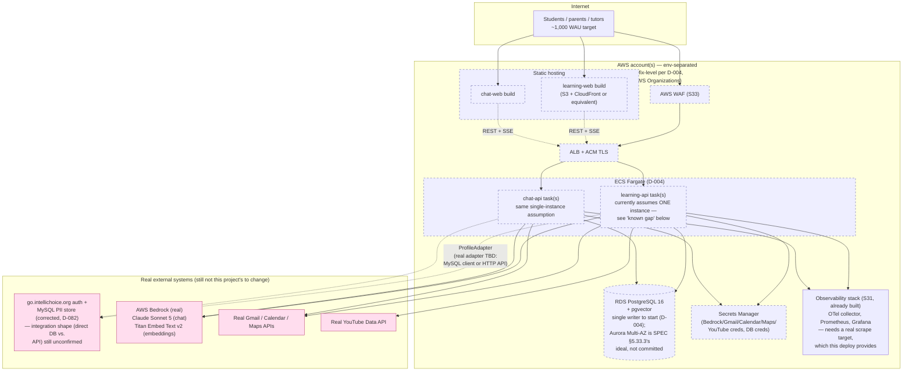

# Final Architecture (projected)

**This is a projection, not an as-built record.** It describes what the system is expected
to look like once every remaining [ROADMAP.md](ROADMAP.md) session (S32 → S34) ships, laid
on top of what's already built. It is not a source of truth the way [ARCHITECTURE.md](
ARCHITECTURE.md) is — that file documents *what exists now* (through S31, S29 deferred);
this file documents *where the plan currently points*, some of which is still an open
decision. Regenerate/reconcile this file once S32–S34 actually land, since real sessions
have repeatedly landed differently than the plan predicted (e.g. D-064's exam-grading
model, D-078's S29 deferral) — treat every claim below as "planned as of 2026-07-21," not
"guaranteed."

## What's already built (S0–S31, S29 deferred)

Everything in [ARCHITECTURE.md](ARCHITECTURE.md) — the deterministic learning core, the
Bedrock-gated AI question-generation pipeline, the LangGraph learning and Q&A workflows,
RAG ingestion/hybrid search, the MCP tool registry (Gmail/Calendar/Maps/YouTube), both
React frontends, memory consolidation, personalized narratives, the evaluation platform,
and observability (OTel/Prometheus/Grafana/LangSmith). That file's 10 diagrams and
cross-cutting invariants aren't reproduced here — read them there. Nothing below changes
any of it; S32–S34 are infrastructure/hardening layers around the existing application,
not a rewrite (ROADMAP.md's own framing: "the apps are containerized either way, so EKS
remains a later migration, not a rewrite").

**One correction already known and not yet propagated into ARCHITECTURE.md/SPEC.md's
prose:** the real `go.intellichoice.org` system is **MySQL**, not MongoDB, contrary to
~50 combined references across SPEC.md/ARCHITECTURE.md (see **D-082**). This file uses the
corrected assumption throughout. The local dev-fake (`docker-compose.yml`'s `mongo:7`
service, `MongoProfileAdapter`) is left as-is for now — D-082 explicitly deferred that
rewrite to whichever session first needs the real integration, which is S32 at the
earliest.

## S32 — Deployment architecture decision + first deploy

**Status: decision-gated, not yet made.** SPEC §5.33–§5.34 prescribes AWS Organizations
(3 accounts), EKS across 3 AZs with Karpenter/HPA, and Aurora PostgreSQL. **D-004**
recommends deferring that and launching on a simpler footprint instead, given a solo
maintainer at ~1,000 MAU/week: ECS Fargate (or an equivalent managed-container service) +
RDS PostgreSQL with pgvector + Terraform, keeping the spec's security posture (env
separation, Secrets Manager, TLS, WAF) without the EKS operational burden (cluster
upgrades, node management, Helm, IRSA). **The actual choice is made at S32's own start**
— this document assumes the D-004 path lands, since it's the recommendation on record
(PROGRESS.md's "Next session" note), but the spec-literal EKS path remains available if
the decision goes the other way.

**Target topology (D-004 path):**

**Work items (ROADMAP.md S32):** Terraform for the chosen footprint, a staging
environment, secrets wiring, domains/TLS, CI deploy to staging. `docs/DECISIONS.md`
should get a follow-up decision entry once the ECS-vs-EKS call is actually made — D-004 is
still "proposed," not "accepted."

**Known gap this session does not obviously close:** the SSE session-event bus
(`services/session_events.py`, `SessionEventBus`) is a single-process in-memory
`dict[str, list[asyncio.Queue]]` (D-032). It assumes exactly one Uvicorn worker. Nothing
in S32's scope (or S33/S34's) schedules replacing it with a real pub/sub (Redis, or
Postgres LISTEN/NOTIFY behind the same `SessionEventBus` interface). At ~1,000 WAU a
single Fargate task per app may be an adequate and deliberate choice, but it also means no
redundancy — a task restart (deploy, crash, AZ issue) drops every open SSE connection, and
this isn't a load-testing target S34 currently lists either. If real high availability is
wanted, this is unfinished work regardless of how far the roadmap runs.

## S33 — Security hardening

**Status: not started.** Scope (SPEC §6.22, ROADMAP.md S33): AWS WAF + rate limiting +
CAPTCHA (currently only `admin_escalation` has any rate limiting — no global API/Bedrock
rate limit exists yet), RBAC audit, secret rotation, dependency + container scanning,
prompt-injection test suite, data/image-deletion verification, backup-restore test.
Layers onto S32's deploy — WAF attaches to the ALB, rate limiting likely lives at the WAF
or gateway layer rather than being reimplemented per-route. "Security and legal reviews
are production release gates" per SPEC — this session doesn't just harden the app, it's
also where the Phase 0 legal/policy docs (Privacy Notice, AI Use Notice, retention policy
— parallel, non-coding track per ROADMAP.md) need to have landed, since counsel review
gates launch, not just this session.

## S34 — Load testing and production readiness

**Status: not started.** Scope (SPEC §6.23, ROADMAP.md S34): k6 (or Locust) scenarios
against the SPEC §5.33.4 targets (1,000+ students, 100+ concurrent learning sessions,
100+ SSE connections, 99.9% monthly availability, API P95 ~1s, LLM time-to-first-token
~3s), failure drills (DB failover, Bedrock throttling, MCP outage, pod/task failure,
rolling deployment), a canary pipeline (SPEC §6.24's Phase 23 CI/CD shape: staging deploy
→ smoke test → load test → canary → metric check → full rollout), and rollback triggers
(error-rate increase, P95 degradation, structured-output failure increase, RAG
citation-accuracy decrease, PII leak detection).

**This is the session most likely to surface the SSE single-instance gap above** — a
"pod/task failure" or "rolling deployment" drill against a single Fargate task per app
will show every open SSE connection dropping, and multi-instance scale testing (if ever
attempted) will show the in-memory bus silently failing to deliver events across
instances. Neither is currently named as a fix target in S34's own scope — only as a
resilience *test*, not a resilience *feature*. Worth flagging explicitly if S34's scope
gets finalized without addressing it.

## Storage split — target state

Adds one row to [ARCHITECTURE.md](ARCHITECTURE.md#storage-split)'s existing table:

| Concern | Store | Notes |
|---|---|---|
| Names, emails, roles, parent–child links, attendance, branch-manager email, branch address/coordinates | **The real `go.intellichoice.org` system (MySQL, per D-082)** | Read-only via `ProfileAdapter`; whether IntelliChoice connects directly to that MySQL instance or through an API `go.intellichoice.org` exposes is **unconfirmed** — resolve before writing the real adapter (S32 or later). The local dev-fake stays `mongo:7`/`MongoProfileAdapter` unless/until that's also revisited. |
| Everything else | Unchanged | See ARCHITECTURE.md's storage-split table — PostgreSQL 16(+pgvector) for all app data, no PII, is unaffected by the deployment decision. |

SPEC §5.33.3's logical-database split (`learning` / `rag` / `memory` / `checkpoint_learning`
/ `checkpoint_chat` / `evaluation` as separate schemas or databases) and Aurora Multi-AZ
are the spec's target, not something D-004 or ROADMAP.md's S32 scope commits to — today's
system is one `intellichoice` Postgres database. Whether S32 adopts the schema split is
part of the open S32 decision, not settled by this document.

## Open questions S32 needs to resolve (not answered by this document)

1. **ECS Fargate vs. EKS** — D-004's recommendation vs. SPEC's literal prescription.
2. **`go.intellichoice.org` integration shape** — direct MySQL connection vs. an HTTP API
   the real system exposes. Changes what the real `ProfileAdapter` implementation looks
   like; unconfirmed as of D-082.
3. **Single vs. multi-instance per app** — directly determines whether the SSE in-memory
   bus (D-032) needs replacing before launch or can stay as a documented limitation.
4. **RDS vs. Aurora, single-AZ vs. Multi-AZ** — cost/ops burden vs. SPEC §5.33.3's ideal,
   for a ~1,000 WAU solo-maintained service.
5. **Logical DB/schema split** — adopt SPEC §5.33.3's six-schema split now, later, or not
   at all.

These aren't gaps in this document — they're gaps in the plan itself, intentionally left
for S32 to decide (ROADMAP.md: "Decide this at session start"). Once decided, update this
file (or fold it back into ARCHITECTURE.md and delete this one) rather than letting the
two drift apart.
